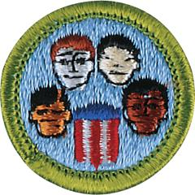

# American Cultures Merit Badge

## Overview

The United States is a nation of immigrants. Every person came to America from somewhere else—or their ancestors did—and understanding these various cultural backgrounds can help Scouts to live in harmony with others in our varied and increasingly multicultural society.

## Requirements

* Choose THREE groups that have different racial, cultural, national, or ethnic backgrounds, one of which comes from your own background. Use these groups to meet requirements 1, 2, and 3.
* (1) Do TWO of the following, choosing a different group for each:
    * (a) Go to a festival, celebration, or other event identified with one of the groups. Report on what you see and learn.
    * (b) Go to a place of worship, school, or other institution identified with one of the groups. Report on what you see and learn.
    * (c) Talk with a person from one of the groups about the heritage and traditions of the group. Report on what you learn.
    * (d) Learn a song, dance, poem, or story that is traditional to one group, and teach it to a group of your friends.
    * (e) Go to a library or museum to see a program or exhibit featuring one group's traditions. Report on what you see and learn.

* (2) Imagine that one of the groups had always lived alone in a city or country to which no other groups ever came. Tell what you think the city or country might be like today. Now tell what you think it might be like if the three groups you chose lived there at the same time.
* (3) Tell about some differences between the religions and social customs of the three groups. Tell about some ideas or ways of doing things that are similar in the three groups.
* (4) Tell about a contribution made to our country by three different people, each from a different racial, ethnic, or religious background.
* (5) Give a talk to your Scout unit or class at school on how people from different groups have gotten along together. Lead a discussion on what can be done to help various groups understand one another better.

## Resources

- [American Cultures merit badge page](https://www.scouting.org/merit-badges/american-cultures/)
- [American Cultures merit badge PDF](https://filestore.scouting.org/filestore/Merit_Badge_ReqandRes/American_Cultures.pdf) ([local copy](files/american-cultures-merit-badge.pdf))
- [American Cultures merit badge pamphlet](https://www.scoutshop.org/american-cultures-merit-badge-pamphlet-655136.html)

Note: This is an unofficial archive of Scouts BSA Merit Badges that was automatically extracted from the Scouting America website and may contain errors.