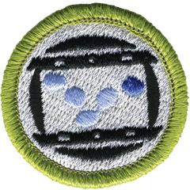

# Animation Merit Badge

## Overview

In Animation merit badge you’ll learn how to create animations, the ways in which animation is used and the fun and exciting career opportunities in animation.

## Requirements

* (1) Do the following:
    * (a) In your own words, describe to your counselor what animation is.
    * (b) Discuss with your counselor a brief history of animation.

* (2) Choose five of the following 12 principles of animation, and discuss how each one makes an animation appear more believable: squash and stretch, anticipation, staging, straight ahead action and pose to pose, follow through and overlapping action, slow in and slow out, arcs, secondary action, timing, exaggeration, solid drawing, appeal.
* (3) With your counselor's approval, choose two animation techniques and do the following for each:
    * (a) Technique 1
        * (1) Plan your animation using thumbnail sketches and/or layout drawings either on paper or using an animation software program.
        * (2) Create the animation.
        * (3) Share your animations with your counselor. Explain how you created each one, and discuss any improvements that could be made.

    * (b) Technique 2
        * (1) Plan your animation using thumbnail sketches and/or layout drawings.
        * (2) Create the animation.
        * (3) Share your animations with your counselor. Explain how you created each one, and discuss any improvements that could be made.

* (4) Do the following:
    * (a) Tour an animation studio or a business where animation is used, either in person, via video, or via the internet. Share what you have learned with your counselor.
    * (b) Discuss with your counselor how animation might be used in the future to make your life more enjoyable and productive.

* (5) Learn about three career opportunities in animation. Pick one and find out about the education, training, and experience required for this profession. Discuss your findings with your counselor. Explain why this profession might interest you.

## Resources

- [Animation merit badge page](https://www.scouting.org/merit-badges/animation/)
- [Animation merit badge PDF](https://filestore.scouting.org/filestore/Merit_Badge_ReqandRes/35778(22)_Animation_REQS.pdf) ([local copy](files/animation-merit-badge.pdf))
- [Animation merit badge pamphlet](None)

Note: This is an unofficial archive of Scouts BSA Merit Badges that was automatically extracted from the Scouting America website and may contain errors.