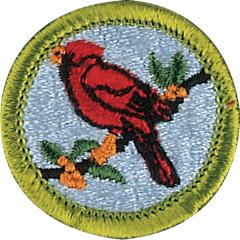

# Bird Study Merit Badge

## Overview

Birds are among the most fascinating creatures on Earth. Many are beautifully colored. Others are accomplished singers. Many of the most important discoveries about birds and how they live have been made by amateur birders. In pursuing this hobby, a Scout might someday make a valuable contribution to our understanding of the natural world.

## Requirements

* (1) Explain the need for bird study and why birds are useful indicators of the quality of the environment. Describe how birds are part of the ecosystem.
* (2) Show that you are familiar with the terms used to describe birds by doing the following:
    * (a) Sketch or trace a perched bird and then label 15 different parts of the bird.
    * (b) Sketch or trace an extended wing and label six types of wing feathers.

* (3) Demonstrate that you know how to properly use and care for binoculars, a spotting scope, or a monocular.
    * (a) Explain what the specification numbers mean on binoculars, a spotting scope, or a monocular.
    * (b) Show how to adjust the eyepiece and how to focus for proper viewing.
    * (c) Show how to properly care for and clean the lenses.
    * (d) Describe when and where each type of viewing device would be most effective.

* (4) Demonstrate that you know how to use a bird field guide. Show your counselor that you are able to understand a range map by locating in the book and pointing out:
    * (a) Seabird
    * (b) Plover
    * (c) Falcon or hawk
    * (d) Warbler or vireo
    * (e) Heron or egret
    * (f) Sparrow.

* (5) Observe and be able to identify 20 species of wild birds. Prepare a field notebook, making a separate entry for each species, and record the following information from your field observations and other references.
    * (a) Note the date and time.
    * (b) Note the location and habitat.
    * (c) Describe the bird's main feeding habitat and list two types of food that the bird is likely to eat.
    * (d) Note whether the bird is a migrant or a summer, winter, or year-round resident of your area.

* (6) Describe to your counselor how certain orders of birds are uniquely adapted to a specific habitat. In your description, include characteristics such as the size and shape of the following:
    * (a) Beak
    * (b) Body
    * (c) Leg and foot
    * (d) Feathers/plumage.

* (7) Explain the function of a bird's song. Be able to identify five of the 20 species in your field notebook by song or call alone. Explain the difference between songs and calls. For each of these five species, enter a description of the song or call, and note the behavior of the bird making the sound. Note why you think the bird was making the call or song that you heard.
* (8) Do ONE of the following:
    * (a) Go on a field trip with a local club or with others who are knowledgeable about birds in your area.
        * (1) Keep a list or fill out a checklist of all the birds your group observed during the field trip.
        * (2) Tell your counselor which birds your group saw and why some species were common and some were present in small numbers.
        * (3) Tell your counselor what makes the area you visited good for finding birds.

    * (b) By using a public library, the internet, or contacting the National Audubon Society, find the name and location of the Christmas Bird Count nearest your home and obtain the results of a recent count.
        * (1) Explain what kinds of information are collected during the annual event.
        * (2) Tell your counselor which species are most common, and explain why these birds are abundant.
        * (3) Tell your counselor which species are uncommon, and explain why these were present in small numbers. If the number of birds of these species is decreasing, explain why, and what, if anything, could be done to reverse their decline.

    * (c) Participate in a bird banding program with an approved federal or state agency, university researcher, bird observatory, or certified private individual.
        * (1) Explain who is able to band birds and why.
        * (2) Explain why birds get banded.
        * (3) Explain what kinds of birds get banded.
        * (4) Tell how the birds were captured, the number of bird species recorded during your visit, and your role in the program.

* (9) Do ONE of the following. For the option you choose, describe what birds you hope to attract, and why.
    * (a) Build a bird feeder and put it in an appropriate place in your yard or another location.
    * (b) Build a birdbath and put it in an appropriate place.
    * (c) Build a backyard sanctuary for birds by planting trees and shrubs for food and cover.
    * (d) Build a nest box for a species of your choice using plans approved by your counselor.

* (10) Do the following:
    * (a) Explain the differences between extinct, endangered, and threatened.
    * (b) Identify a bird species that is on the endangered or threatened list. Explain what caused their decline. Discuss with your counselor what can be done to reverse this trend and what can be done to help remove the species from the endangered or threatened list.

* (11) Identify a non-native bird (introduced to North America from a foreign country since 1800). Describe how non-native birds may become damaging to the ecosystem.
* (12) Identify three career opportunities connected to the study of birds. Pick one and find out the education, training, and experience required for this profession. Discuss with your counselor if this profession might interest you.

## Resources

- [Bird Study merit badge page](https://www.scouting.org/merit-badges/bird-study/)
- [Bird Study merit badge PDF](https://filestore.scouting.org/filestore/Merit_Badge_ReqandRes/Bird_Study.pdf) ([local copy](files/bird-study-merit-badge.pdf))
- [Bird Study merit badge pamphlet](https://www.scoutshop.org/bsa-bird-study-merit-badge-pamphlet-661586.html)

Note: This is an unofficial archive of Scouts BSA Merit Badges that was automatically extracted from the Scouting America website and may contain errors.