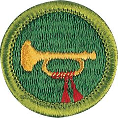

# Bugling Merit Badge

## Overview

What would summer camp be without the bugle sounding “Reveille” in the morning and “Taps” in the evening? Camp and the bugle go together. The bugle is an ideal instrument for the beginning musician because most of the music uses only four notes. The ability to read music is not necessary, because the tunes are familiar and can be played ear.

## Requirements

* (1) Give a brief history of the bugle.
* (2) Do the following:
    * (a) Explain and demonstrate how the bugle makes sound, and explain how the bugle is related to other brass wind instruments.
    * (b) Compose a bugle call for your troop or patrol to signal a common group activity, such as assembling for mealtime or striking a campsite. Play the call that you have composed before your unit or patrol.

* (3) Sound 10 of the following bugle calls: "First Call," "Reveille," "Assembly," "Mess," "Drill," "Fatigue," "Officers," "Recall," "Church," "Swimming," "Fire," "Retreat," "To the Colors," "Call to Quarters," "Taps."
* (4) Explain when each of the calls in requirement 3 is used
* (5) Explain how to care for, clean, and maintain a bugle.
* (6) Serve as bugler in your troop for three months. *
* \* NOTE: A bugle, trumpet, or cornet may be used to meet these requirements.

## Resources

- [Bugling merit badge page](https://www.scouting.org/merit-badges/bugling/)
- [Bugling merit badge PDF](https://filestore.scouting.org/filestore/Merit_Badge_ReqandRes/Pamphlets/Music%20Bugling_2024.pdf) ([local copy](files/music-merit-badge.pdf))
- [Bugling merit badge pamphlet](https://www.scoutshop.org/music-and-bugling-merit-badge-pamphlet-650736.html)

Note: This is an unofficial archive of Scouts BSA Merit Badges that was automatically extracted from the Scouting America website and may contain errors.