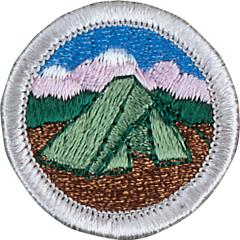

# Camping Merit Badge

## Overview

**Eagle required**

Camping is one of the best-known methods of the Scouting movement. When he founded the Scouting movement in the early 1900s, Robert Baden-Powell encouraged every Scout to learn the art of living out-of-doors. He believed a young person able to take care of himself while camping would have the confidence to meet life’s other challenges, too.

## Requirements

* (1) Do the following:
    * (a) Explain to your counselor the most likely hazards you may encounter while participating in camping activities and what you should do to anticipate, help prevent, mitigate, and respond to these hazards. Resources:
    * (b) Discuss with your counselor why it is important to be aware of weather conditions before and during your camping activities. Tell how you can prepare should the weather turn bad during your campouts. Resources:
    * (c) Show that you know first aid for and how to prevent injuries or illnesses that could occur while camping, including hypothermia, frostbite, heat reactions, dehydration, altitude sickness, insect stings, tick bites, snakebite, blisters, hyperventilation. Resources:

* (2) Learn the Leave No Trace Seven Principles and the Outdoor Code, and explain what they mean. Write a personal and group plan for implementing these principles on your next outing.Resources:
* (3) Make a written plan for an overnight trek and show how to get to your  camping spot by using a topographical map and one of the following:Resources:
    * (a) Compass Resource:
    * (b) GPS receiver Resource:
    * (c) Smartphone with a GPS app.  Resource:

* (4) Do the following:
    * (a) Make a duty roster showing how your patrol is organized for an actual overnight campout. List assignments for each member. Resource:
    * (b) Help a Scout patrol or a Webelos Scout unit in your area prepare for an actual campout, including creating the duty roster, menu planning, equipment needs, general planning, and setting up camp. Resource:

* (5) Do the following:
    * (a) Prepare a list of clothing you would need for overnight campouts in both warm and cold weather. Explain the term "layering." Resources:
    * (b) Discuss footwear for different kinds of weather and how the right footwear is important for protecting your feet. Resource:
    * (c) Explain the proper care and storage of camping equipment (clothing, footwear, bedding). Resource:
    * (d) List the outdoor essentials necessary for any campout, and explain why each item is needed. Resources:
    * (e) Present yourself to your Scoutmaster with your pack for inspection. Be correctly clothed and equipped for an overnight campout.

* (6) Do the following:
    * (a) Describe the features of four types of tents, when and where they could be used, and how to care for tents. Working with another Scout, pitch a tent. Resources:
    * (b) Discuss the importance of camp sanitation and tell why water treatment is essential. Then demonstrate two ways to treat water. Resources:
    * (c) Describe the factors to be considered in deciding where to pitch your tent. Resources:
    * (d) Tell the difference between internal- and external-frame packs. Discuss the advantages and disadvantages of each. Resource:
    * (e) Discuss the types of sleeping bags and what kind would be suitable for different conditions. Explain the proper care of your sleeping bag and how to keep it dry. Make a comfortable ground bed. Resources:

* (7) Prepare for an overnight campout with your patrol by doing the following:
    * (a) Make a checklist of personal and patrol gear that will be needed.
    * (b) Pack your own gear and your share of the patrol equipment and food for proper carrying. Show that your pack is right for quickly getting what is needed first, and that it has been assembled properly for comfort, weight, balance, size, and neatness. Resource:

* (8) Do the following:
    * (a) Explain the safety procedures for:
        * (1) Using a propane or butane/propane stove Resource:
        * (2) Using a liquid fuel stove Resource:
        * (3) Proper storage of extra fuel.

    * (b) Discuss the advantages and disadvantages of different types of lightweight cooking stoves. Resource:
    * (c) Prepare a camp menu. Explain how the menu would differ from a menu for a backpacking or float trip. Give recipes and make a food list for your patrol. Plan two breakfasts, three lunches, and two suppers. Discuss how to protect your food against bad weather, animals, and contamination. Resources:
    * (d) While camping in the outdoors, cook at least one breakfast, one lunch, and one dinner for your patrol from the meals you have planned for requirement 8(c). At least one of those meals must be a trail meal requiring the use of a lightweight stove. Resource:

* (9) Show experience in camping by doing the following:
    * (a) Camp for at least 20 nights at designated Scouting activities or events. One long-term camping experience of up to six consecutive nights may be applied toward this requirement. Two nights may be counted toward the total for each additional long-term camping trip. Each night must be spent either under the sky, in a tent you have pitched yourself (if a tent is provided and already set up, you do not need to pitch your own), in a hammock that is safely strung outdoors, in a lean-to, or other three-sided shelter with an open front. Nights spent in indoor lock-in events, cabin camping, hotel stays, or other covered accommodations do not count toward the 20 nights.
    * (b) On any of these camping experiences, you must do TWO of the following, only with proper preparation and under qualified supervision.
        * (1) Hike up a mountain, gaining at least 1,000 vertical feet. Resource:
        * (2) Backpack, snowshoe, or cross-country ski for at least 4 miles. Resource:
        * (3) Take a bike trip of at least 15 miles or at least four hours. Resource:
        * (4) Take a nonmotorized trip on the water of at least four hours or 5 miles. Resource:
        * (5) Plan and carry out an overnight snow camping experience. Resource:
        * (6) Rappel down a rappel route of 30 feet or more. Resource:

    * (c) On any of these camping experiences, perform a conservation project approved by the landowner or land managing agency. This can be done alone or with others. Resource:

* (10) Discuss how the things you did to earn this badge have taught you about  personal health and safety, survival, public health, conservation, and good  citizenship. In your discussion, tell how Scout spirit and the Scout Oath and Scout Law apply to camping and outdoor ethics.

## Resources

- [Camping merit badge page](https://www.scouting.org/merit-badges/camping/)
- [Camping merit badge PDF](https://filestore.scouting.org/filestore/Merit_Badge_ReqandRes/Pamphlets/Camping_2024.pdf) ([local copy](files/camping-merit-badge.pdf))
- [Camping merit badge pamphlet](https://www.scoutshop.org/scouts-bsa-camping-merit-badge-pamphlet-662366.html)

Note: This is an unofficial archive of Scouts BSA Merit Badges that was automatically extracted from the Scouting America website and may contain errors.