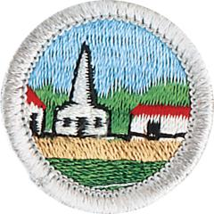

# Citizenship in the Community Merit Badge

## Overview

**Eagle required**

A nation is a patchwork of communities that differ from each other and may be governed differently. But regardless of how local communities differ, they all have one point in common: In the United States, local government means self-government. Good citizens help to make decisions about their community through their elected local officials.

## Requirements

* (1) Discuss with your counselor what citizenship in the community means and what it takes to be a good citizen in your community. Discuss the rights, duties, and obligations of citizenship, and explain how you can demonstrate good citizenship in your community, Scouting unit, place of worship, or school.
* (2) Do the following:
    * (a) Using an electronic mapping tool or paper map, locate and pinpoint the following services and landmarks in your community. Determine and record the distances from your home including driving time AND either walking or biking time.
    * (b) Chart the organization of your local or state government. Show the top offices and tell whether they are elected or appointed.

* (3) Do the following:
    * (a) Attend an in-person meeting of your city, town, or county council or school board, local court session; OR another state or local governmental meeting approved in advance by your counselor.
    * (b) Choose one of the issues discussed at the meeting where a difference of opinions was expressed, and explain to your counselor why you agree with one opinion more than you do another one.

* (4) Choose an issue that is important to the citizens of your community; then do the following:
    * (a) Find out which branch of local government is responsible for this issue.
    * (b) With your counselor's and a parent or guardian's approval, interview one person from the branch of government you identified in requirement 4a. Ask what is being done about this issue and how young people can help.
    * (c) Share what you have learned with your counselor.

* (5) With the approval of your counselor and a parent or guardian, watch a movie that shows how the actions of one individual or group of individuals can have a positive effect on a community. Discuss with your counselor what you learned from the movie about what it means to be a valuable and concerned member of the community.
* (6) List some of the services (such as the library, recreation center, public transportation, and public safety) your community provides that are funded by taxpayers. Tell your counselor why these services are important to your community.
* (7) Do the following:
    * (a) Identify three charitable organizations outside of Scouting that interest you and bring people in your community together to work for the good of your community.
    * (b) Pick ONE of the organizations you chose for requirement 7a. Using a variety of resources (including newspapers, fliers and other literature, the Internet, volunteers, and employees of the organization), find out more about this organization.
    * (c) With your counselor's and your parent or guardian's approval, contact the organization you chose for requirement 7b, and find out what young people can do to help. While working on this merit badge, volunteer at least eight hours of your time for the organization. After your volunteer experience is over, discuss what you have learned with your counselor.

* (8) Develop a public presentation (such as a video, slide show, speech, digital presentation, or photo exhibit) about important and unique aspects of your community. Include information about the history, cultures, and ethnic groups of your community; its best features and popular places where people gather; and the challenges it faces. Stage your presentation in front of your counselor or a group, such as your patrol or a class at school.

## Resources

- [Citizenship in the Community merit badge page](https://www.scouting.org/merit-badges/citizenship-in-the-community/)
- [Citizenship in the Community merit badge PDF](https://filestore.scouting.org/filestore/Merit_Badge_ReqandRes/Pamphlets/Citizenship%20in%20the%20Community_2024.pdf) ([local copy](files/citizenship-in-the-community-merit-badge.pdf))
- [Citizenship in the Community merit badge pamphlet](https://www.scoutshop.org/citizenship-in-the-community-merit-badge-pamphlet-662368.html)

Note: This is an unofficial archive of Scouts BSA Merit Badges that was automatically extracted from the Scouting America website and may contain errors.