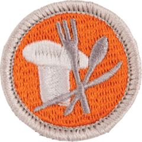

# Cooking Merit Badge

## Overview

**Eagle required**

The Cooking merit badge introduces principles of cooking that can be used both at home or in the outdoors. Scouts who earn this badge will learn about food safety, nutritional guidelines, meal planning, and methods of food preparation, and will review the variety of culinary (or cooking) careers available.

## Requirements

* 
* (1) Do the following:
    * (a) Explain to your counselor the most likely hazards you may encounter while participating in cooking activities and what you should do to anticipate, help prevent, mitigate, and respond to these hazards. Resources:
    * (b) Show that you know first aid for and how to prevent injuries or illnesses that could occur while preparing meals and eating, including burns and scalds, cuts, choking, and allergic reactions. Resources:
    * (c) Describe how meat, fish, chicken, eggs, dairy products, and fresh vegetables should be stored, transported, and properly prepared for cooking. Explain how to prevent cross-contamination. Resource:
    * (d) Discuss with your counselor food allergies, food intolerance, and food-related illnesses and diseases. Explain why someone who handles or prepares food needs to be aware of these concerns. Resources:
    * (e) Discuss with your counselor why reading food labels is important. Explain how to identify common allergens such as peanuts, tree nuts, milk, eggs, wheat, soy, and shellfish. Resource:

* (2) Do the following:
    * (a) Using the MyPlate food guide or the current USDA nutrition model, give five examples for EACH of the following food groups, the recommended number of daily servings, and the recommended serving size:   (1) Fruits  (2) Vegetables  (3) Grains  (4) Proteins  (5) Dairy.  Resource:
    * (b) Explain why you should limit your intake of oils and sugars. Resource:
    * (c) Track your daily level of activity and your daily caloric need based on your activity for five days. Then, based on the MyPlate food guide, discuss with your counselor an appropriate meal plan for yourself for one day. Resource:
    * (d) Discuss your current eating habits with your counselor and what you can do to eat healthier, based on the MyPlate food guide. Resource:
    * (e) Discuss the following food label terms: calorie, fat, saturated fat, trans fat, cholesterol, sodium, carbohydrate, dietary fiber, sugar, and protein. Explain how to calculate total carbohydrates and nutritional values for two servings, based on the serving size specified on the label. Resource:

* (3) Do the following:
    * (a) Discuss the following cooking methods. For each one, describe the equipment needed, how temperature control is maintained, and name at least one food that can be cooked using that method: baking, boiling, broiling, pan frying, simmering, microwaving, air frying, grilling, foil cooking, and Dutch oven. Resources:
    * (b) Discuss the benefits of using a camp stove on an outing vs. a charcoal or wood fire. Resource:
    * (c) Describe for your counselor how to manage your time when preparing a meal so components for each course are ready to serve at the correct time. Resource:
    * (d) Explain and give examples of how taste, texture, and smell impact what we eat. Resource:

* (4) Do the following:The meals for requirement 4 may be prepared on different days, and they need not be prepared consecutively. The requirement calls for Scouts to plan, prepare, and serve one breakfast, one lunch, and one dinner to at least one adult; those served need not be the same for all meals.Resource:
    * (a) Using the MyPlate food guide or the current USDA nutrition model, plan menus for three full days of meals (three breakfasts, three lunches, and three dinners) plus one dessert. Your menus should include enough to feed yourself and at least one adult, keeping in mind any special needs (such as food allergies) and how you keep your foods safe and free from cross-contamination. List the equipment and utensils needed to prepare and serve these meals.  Resource:
    * (b) Find recipes for each meal. Create a shopping list for your meals showing the amount of food needed to prepare for the number of people you will serve. Determine the cost for each meal. Resource:
    * (c) Share and discuss your meal plan and shopping list with your counselor.  Resource:
    * (d) Using at least five of the 10 cooking methods from requirement 3, prepare and serve yourself and at least one adult (parent, family member, guardian, or other responsible adult) one breakfast, one lunch, one dinner, and one dessert from the meals you planned.
    * (e) Time your cooking to have each meal ready to serve at the proper time. Have an adult verify the preparation of the meal to your counselor. Resource:
    * (f) After each meal, ask a person you served to evaluate the meal on presentation and taste, then evaluate your own meal. Discuss what you learned with your counselor, including any adjustments that could have improved or enhanced your meals. Tell how planning and preparation help ensure a successful meal.

* (5) Do the following:
    * (a) Using the MyPlate food guide or the current USDA nutrition model, plan a menu that includes four meals, one snack, and one dessert for your patrol (or a similar size group of up to eight youth, including you) on a camping trip. These four meals must include two breakfasts, one lunch, and one dinner. Additionally, you must plan one snack and one dessert. Your menus should include enough food for each person, keeping in mind any special needs (such as food allergies) and how you keep your foods safe and free from cross-contamination. List the equipment and utensils needed to prepare and serve these meals. Resource:
    * (b) Find or create recipes for the four meals, the snack, and the dessert you have planned. Adjust menu items in the recipes for the number to be served. Create a shopping list and budget to determine the per-person cost. Resource:
    * (c) Share and discuss your menu plans and shopping list with your counselor.
    * (d) In the outdoors, using your menu plans and recipes for this requirement, cook two of the four meals you planned using either a camp stove OR backpacking stove. Use a skillet OR a Dutch oven over campfire coals for the third meal, and cook the fourth meal in a foil pack OR on a skewer. Serve all of these meals to your patrol or a group of youth. Resources:
    * (e) In the outdoors, using your menu plans and recipes for this requirement, prepare one snack and one dessert. Serve both of these to your patrol or a group of youth.
    * (f) After each meal, have those you served evaluate the meal on presentation and taste, and then evaluate your own meal. Discuss what you learned with your counselor, including any adjustments that could have improved or enhanced your meals. Tell how planning and preparation help ensure successful outdoor cooking.
    * (g) Lead the clean-up of equipment, utensils, and the cooking site thoroughly after each meal. Properly store or dispose unused ingredients, leftover food, dishwater and garbage. Resource:
    * (h) Discuss how you followed the Leave No Trace Seven Principles and the Outdoor Code when preparing your meals. Resources:

* (6) Do the following:
    * (a) Using the MyPlate food guide or the current USDA nutrition model, plan a day of meals for trail hiking or backpacking that includes one breakfast, one lunch, one dinner, and one snack. These meals must consider weight, not require refrigeration and are to be consumed by three to five people (including you). List the equipment and utensils needed to prepare and serve these meals. Resource:
    * (b) Create a shopping list for your meals, showing the amount of food needed to prepare and serve each meal, and the cost for each meal.
    * (c) Share and discuss your menu and shopping list with your counselor. Your plan must include how to repackage foods for your hike or backpacking trip to eliminate as much bulk, weight, and garbage as possible. Resource:
    * (d) While on a trail hike or backpacking trip, prepare and serve two meals and a snack from the menu planned for this requirement. At least one of those meals must be cooked over a fire, or an approved trail stove (with proper supervision). Resource:
    * (e) After each meal, have those you served evaluate the meal on presentation and taste, then evaluate your own meal. Discuss what you learned with your counselor, including any adjustments that could have improved or enhanced your meals. Tell how planning and preparation help ensure successful trail hiking or backpacking meals.
    * (f) Explain to your counselor how you should divide the food and cooking supplies among the patrol in order to share the load. Discuss how to properly clean the cooking area and store your food to protect it from animals. Resource:

* (7) Do ONE of the following:
    * (a) Identify three career opportunities that would use skills and knowledge in cooking. Pick one and research the training, education, certification requirements, experience, and expenses associated with entering the field. Research the prospects for employment, starting salary, advancement opportunities and career goals associated with this career. Discuss what you learned with your counselor and whether you might be interested in this career.  Resources:
    * (b) Identify how you might use the skills and knowledge in cooking to pursue a personal hobby or healthy lifestyle. Research the additional training required, expenses, and affiliation with organizations that would help you maximize the enjoyment and benefit you might gain from it. Discuss what you learned with your counselor and share what short-term and long-term goals you might have if you pursued this. Resources:

## Resources

- [Cooking merit badge page](https://www.scouting.org/merit-badges/cooking/)
- [Cooking merit badge PDF](https://filestore.scouting.org/filestore/Merit_Badge_ReqandRes/Pamphlets/Cooking_2023.pdf) ([local copy](files/cooking-merit-badge.pdf))
- [Cooking merit badge pamphlet](https://www.scoutshop.org/bsa-cooking-merit-badge-pamphlet-es-boy-scouts-of-america-660397.html)

Note: This is an unofficial archive of Scouts BSA Merit Badges that was automatically extracted from the Scouting America website and may contain errors.