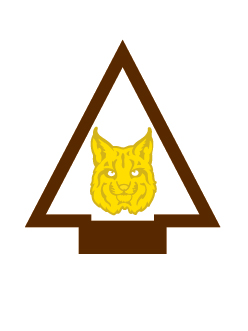

# Bobcat Arrow of Light Arrow of Light Adventure

- **Adventure name:** Bobcat Arrow of Light
- **Rank:** Arrow of Light
- **Type:** Required
- **Category:** Character & Leadership

## Overview

The Bobcat Adventure is the first required Adventure on your Trail and will get you and your patrol off to a great start. Once you have completed the Bobcat Adventure, you can work on the other Adventures in any order. In this Adventure, you’ll learn about things like the Scout slogan and the patrol method. You’ll find out about ranks in Scouting America and merit badges. And you’ll visit a Scouting America troop. Prior to any activity, use Scouting America’s SAFE Checklist to ensure the safety of all those involved. All participants in official Scouting America activities should become familiar with the Guide to Safe Scouting and applicable program literature or manuals.

## Requirements

### Requirement 1

Demonstrate the patrol method by choosing a patrol name and electing a patrol leader. Discuss the benefits of using the patrol method.

**Activities:**

- **[Patrol Elections](https://www.scouting.org/cub-scout-activities/patrol-elections/)** (Indoor, energy 2, supplies 2, prep 2)
  Cub Scouts choose a patrol name and elect a patrol leader.

### Requirement 2

Get to know members of your patrol.

**Activities:**

- **[Beach Ball Questions](https://www.scouting.org/cub-scout-activities/beach-ball-questions/)** (Indoor, energy 3, supplies 2, prep 2)
  Cub Scouts get to know each other using a beach ball.
- **[Compliment Circle](https://www.scouting.org/cub-scout-activities/compliment-circle/)** (Indoor, energy 1, supplies 1, prep 1)
  Cub Scouts share compliments about each other.
- **[Patrol Flag Arrow of Light](https://www.scouting.org/cub-scout-activities/patrol-flag-arrow-of-light/)** (Indoor, energy 2, supplies 4, prep 3)
  Cub Scouts create a patrol flag.

### Requirement 3

Recite the Scout Oath and Scout Law with your patrol.

**Activities:**

- **[Recite the Oath and Law Arrow of Light](https://www.scouting.org/cub-scout-activities/recite-the-oath-and-law-arrow-of-light/)** (Indoor, energy 1, supplies 1, prep 1)
  Learn and reinforce the Scout Oath and the Scout Law by reciting it with your patrol.

### Requirement 4

With your patrol create a Code of Conduct.

**Activities:**

- **[Patrol Code of Conduct](https://www.scouting.org/cub-scout-activities/patrol-code-of-conduct/)** (Indoor, energy 2, supplies 2, prep 2)
  Cub Scouts will be invested in their conduct when they help create their code of conduct.

### Requirement 5

Demonstrate the Scout sign, Scout salute and Scout handshake used by Scouting America. Show how each are used.

**Activities:**

- **[Scouts BSA Sign, Salute, and Handshake](https://www.scouting.org/cub-scout-activities/scouts-bsa-sign-salute-and-handshake/)** (Indoor, energy 2, supplies 2, prep 2)
  Cub Scouts learn the Scouts BSA sign, salute, and handshake and how each is used.

### Requirement 6

Learn the Scouting America slogan and motto.

**Activities:**

- **[Scouts BSA Slogan & Motto](https://www.scouting.org/cub-scout-activities/scouts-bsa-slogan-motto/)** (Indoor, energy 1, supplies 2, prep 1)
  Cub Scouts learn the Scouts BSA slogan and motto and how to use them.

### Requirement 7

With your patrol, or with your parent/legal guardian, visit a Scouting America troop.

**Activities:**

- **[Scouts BSA Troop Daytime Activity](https://www.scouting.org/cub-scout-activities/scouts-bsa-troop-daytime-activity/)** (Travel, energy 4, supplies 3, prep 5)
  Cub Scouts attend a daytime activity with a local Scouts BSA troop.
- **[Scouts BSA Troop Meeting Scavenger Hunt](https://www.scouting.org/cub-scout-activities/scouts-bsa-troop-meeting-scavenger-hunt/)** (Travel, energy 4, supplies 2, prep 5)
  During a visit with a Scouts BSA troop, Cub Scouts look for key elements and experiences of the troop meeting.
- **[Scouts BSA Troop Overnight](https://www.scouting.org/cub-scout-activities/scouts-bsa-troop-overnight/)** (Travel, energy 4, supplies 5, prep 5)
  Cub Scouts attend an overnight activity with a local Scouts BSA troop.

### Requirement 8

At home, with your parent or legal guardian do the activities in the booklet “How to Protect Your Children from Child Abuse: A Parent’s Guide.”

**Activities:**

- **[Child Abuse Protection Review Arrow of Light](https://www.scouting.org/cub-scout-activities/child-abuse-protection-review-arrow-of-light/)** (Indoor, energy 1, supplies 2, prep 1)
  Review the activities in the booklet “How to Protect Your Children from Child Abuse: A Parent’s Guide.”

## Resources

- [Bobcat Arrow of Light Arrow of Light adventure page](https://www.scouting.org/cub-scout-adventures/bobcat-aol/)

Note: This is an unofficial archive of Cub Scout Adventures that was automatically extracted from the Scouting America website and may contain errors.