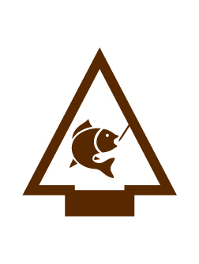

# Fishing Arrow of Light Adventure

- **Adventure name:** Fishing
- **Rank:** Arrow of Light
- **Type:** Elective
- **Category:** 

## Overview

You may have gone fishing before and know some basics. In this Adventure, you will learn how to plan a fishing experience using Scouting America’s SAFE Checklist. This will help you be prepared for future adventures in Scouts BSA. Adventure Safety Moment Prior to any activity, use Scouting America’s SAFE Checklist to ensure the safety of all those involved.

## Requirements

### Requirement 1

Make a plan to go fishing. Determine where you will go and what type of fish you plan to catch. All of the following requirements are to be completed based on your choice.

**Activities:**

- **[My Fishing Trip](https://www.scouting.org/cub-scout-activities/my-fishing-trip/)** (Indoor, energy 2, supplies 2, prep 2)
  Cub Scouts plan their fishing adventure.

### Requirement 2

Use Scouting America’s SAFE Checklist to plan what you need for your fishing experience.

**Activities:**

- **[Hooked on Safety](https://www.scouting.org/cub-scout-activities/hooked-on-safety/)** (Indoor, energy 2, supplies 2, prep 2)
  Cub Scouts use  Scouting America  SAFE checklist for their fishing adventure.

### Requirement 3

Describe the environment where the fish might be found.

**Activities:**

- **[“Reel” Estate](https://www.scouting.org/cub-scout-activities/reel-estate/)** (Indoor, energy 2, supplies 2, prep 2)
  Cub Scouts  create  a flyer to advertise local aquatic ecosystems and fish habitats.
- **[Fin-tastic Habitat Chat](https://www.scouting.org/cub-scout-activities/fin-tastic-habitat-chat/)** (Indoor, energy 2, supplies 2, prep 5)
  Cub Scouts learn about local fish from a guest speaker.
- **[Model Habitat](https://www.scouting.org/cub-scout-activities/model-habitat/)** (Indoor, energy 3, supplies 4, prep 3)
  Cub Scouts make a model of a local fish habitat.

### Requirement 4

Make a list of the equipment and materials you will need to fish.

**Activities:**

- **[Tackle Box Tune-Up](https://www.scouting.org/cub-scout-activities/tackle-box-tune-up/)** (Indoor, energy 2, supplies 5, prep 5)
  Cub Scouts learn what equipment and materials should be included in a personal tackle box.

### Requirement 5

Determine the best type of knot to tie your hook to your line and tie it.

**Activities:**

- **[Four Fishing Knots](https://www.scouting.org/cub-scout-activities/four-fishing-knots/)** (Indoor, energy 3, supplies 3, prep 3)
  Cub Scouts practice fishing knots by doing stations around the meeting space.

### Requirement 6

On your own, choose the appropriate type of fishing rod and tackle you will be using. Have an adult review your gear.

**Activities:**

- **[Hook, Line and Sinker](https://www.scouting.org/cub-scout-activities/hook-line-and-sinker/)** (Indoor, energy 2, supplies 1, prep 3)
  Cub Scouts have their fishing gear checked by an adult leader.

### Requirement 7

Using what you have learned about fish and fishing equipment, spend at least one hour fishing following local guidelines and regulations.

**Activities:**

- **[My Fishing Trip AOL](https://www.scouting.org/cub-scout-activities/my-fishing-trip-aol/)** (Travel, energy 4, supplies 5, prep 5)
  Cub Scouts go fishing for at least one hour.

## Resources

- [Fishing Arrow of Light adventure page](https://www.scouting.org/cub-scout-adventures/fishing/)

Note: This is an unofficial archive of Cub Scout Adventures that was automatically extracted from the Scouting America website and may contain errors.