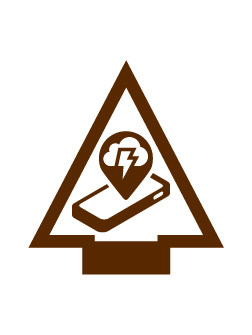

# High Tech Outdoors Arrow of Light Adventure

- **Adventure name:** High Tech Outdoors
- **Rank:** Arrow of Light
- **Type:** Elective
- **Category:** 

## Overview

Long ago, tents were made from cotton canvas. They were heavy and were not waterproof. If you put them away wet, they could mold and rot. Today, tents are made using synthetic (human-made) materials that are waterproof, lightweight, breathable, and resistant to mold and rot. Not only has technology improved tents, but it’s also given us digital devices that help us navigate, learn, and stay safe. Prior to any activity, use Scouting America’s SAFE Checklist to ensure the safety of all those involved. All participants in official Scouting America activities should become familiar with the Guide to Safe Scouting and applicable program literature or manuals.

## Requirements

### Requirement 1

With an adult, use a weather app or website to see the forecast for an outdoor activity and discuss any preparation needed to accommodate the weather.

**Activities:**

- **[Whether the Weather Will Be Good](https://www.scouting.org/cub-scout-activities/whether-the-weather-will-be-good/)** (Indoor, energy 1, supplies 3, prep 1)
  Cub Scouts use a weather app to prep for an outing.

### Requirement 2

With an adult, find a knot-tying app. Select one knot to learn, and tie it using the app.

**Activities:**

- **[Knot Another App](https://www.scouting.org/cub-scout-activities/knot-another-app/)** (Indoor, energy 2, supplies 3, prep 2)
  Cub Scouts learn to tie knots.

### Requirement 3

Discuss how technology has improved camping gear.

**Activities:**

- **[Ask the Expert](https://www.scouting.org/cub-scout-activities/ask-the-expert/)** (Indoor, energy 2, supplies 1, prep 5)
  Invite an outdoor expert to a den meeting to talk improvements in camping gear.
- **[Newer, Lighter, Better Gear](https://www.scouting.org/cub-scout-activities/newer-lighter-better-gear/)** (Travel, energy 2, supplies 1, prep 5)
  Visit a retailer that specializes in the outdoors and talk camping gear.

### Requirement 4

Think of a way technology can improve camping gear used on one of your outdoor activities.

**Activities:**

- **[Camping Gear 2.0](https://www.scouting.org/cub-scout-activities/camping-gear-2-0/)** (Indoor, energy 2, supplies 4, prep 3)
  Cub Scouts model their own improvement of camping gear.
- **[Design and Draw](https://www.scouting.org/cub-scout-activities/design-and-draw/)** (Indoor, energy 1, supplies 2, prep 1)
  Cub Scouts create drawings of their own improvement of camping gear.
- **[Filming the Fix](https://www.scouting.org/cub-scout-activities/filming-the-fix/)** (Indoor, energy 2, supplies 2, prep 1)
  Cub Scouts create a video describing their own improvement of camping gear.

## Resources

- [High Tech Outdoors Arrow of Light adventure page](https://www.scouting.org/cub-scout-adventures/high-tech-outdoors/)

Note: This is an unofficial archive of Cub Scout Adventures that was automatically extracted from the Scouting America website and may contain errors.