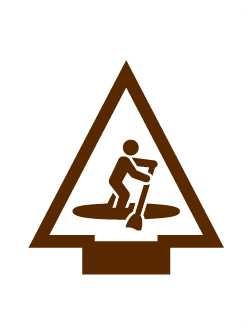

# Paddle Craft Arrow of Light Adventure

- **Adventure name:** Paddle Craft
- **Rank:** Arrow of Light
- **Type:** Elective
- **Category:** 

## Overview

Adult leaders supervising activities afloat must have completed Safety Afloat training within the previous two years. Cub Scout activities afloat are limited to council, district, pack, or den events on calm or gently flowing water that do not include float trips (expeditions). Safety Afloat standards apply to the use of canoes, kayaks, rowboats, rafts, floating tubes, sailboats, motorboats (including waterskiing), and other small craft (Stand Up Paddle Boards). Getting out on the water and paddling around is a great way to enjoy the outdoors and go places that you can only get to with a paddle craft . The boundary waters of Minnesota, the shoals of the Florida Keys, and countless rivers and lakes across the United States are available to only those who choose to paddle there . In this Adventure, you can choose a canoe, kayak, or stand-up paddleboard to complete the requirements. Prior to any activity, use Scouting America SAFE Checklist to ensure the safety of all those involved.

## Requirements

### Requirement 1

Before attempting requirements 5, 6, 7, 8 and 9 for this Adventure, you must pass Scouting America swimmer test.

**Activities:**

- **[AOL Swimmers Test](https://www.scouting.org/cub-scout-activities/aol-swimmers-test/)** (Travel, energy 5, supplies 4, prep 5)
  Cub Scouts swim for the Scouting America swimmer test.

### Requirement 2

Pick a paddle craft for which to complete all requirements: canoe, kayak, or stand-up paddleboard.

**Activities:**

- **[AOL Pick a Paddle](https://www.scouting.org/cub-scout-activities/aol-pick-a-paddle/)** (Indoor, energy 1, supplies 1, prep 1)
  Cub Scouts pick from one of the paddle crafts to complete remaining requirements.

### Requirement 4

Demonstrate how to choose and properly wear a life jacket that is the correct size.

**Activities:**

- **[AOL Life Jacket Safety](https://www.scouting.org/cub-scout-activities/aol-life-jacket-safety/)** (Indoor, energy 2, supplies 5, prep 2)
  Cub Scouts learn about life jackets.

### Requirement 5

Jump feet first into water over your head while wearing a life jacket then swim 25 feet wearing the life jacket.

**Activities:**

- **[AOL Float with Confidence](https://www.scouting.org/cub-scout-activities/aol-float-with-confidence/)** (Travel, energy 5, supplies 5, prep 5)
  Cub Scouts use life  jacket  in the water.

### Requirement 6

Demonstrate how to enter and exit a canoe, kayak, or stand-up paddleboard safely.

**Activities:**

- **[AOL Launch and Depart Canoe](https://www.scouting.org/cub-scout-activities/aol-launch-and-depart-canoe/)** (Travel, energy 5, supplies 5, prep 5)
  Cub Scouts practice how to enter and exit a canoe safely.
- **[AOL Launch and Depart Kayak](https://www.scouting.org/cub-scout-activities/aol-launch-and-depart-kayak/)** (Travel, energy 5, supplies 5, prep 5)
  Cub Scouts practice how to enter and exit a kayak safely.
- **[AOL Launch and Depart Stand-up Paddle Board](https://www.scouting.org/cub-scout-activities/aol-launch-and-depart-stand-up-paddle-board/)** (Travel, energy 5, supplies 5, prep 5)
  Cub Scouts practice how to enter and exit a stand-up paddle board safely.

### Requirement 7

Discuss what to do if your canoe or kayak tips over or you fall off your stand-up paddleboard.

**Activities:**

- **[AOL Canoe Resilience](https://www.scouting.org/cub-scout-activities/aol-canoe-resilience/)** (Travel, energy 5, supplies 5, prep 5)
  Cub Scouts learn what to do if their canoe  tips  over.
- **[AOL Kayak Resilience](https://www.scouting.org/cub-scout-activities/aol-kayak-resilience/)** (Travel, energy 5, supplies 5, prep 5)
  Cub Scouts learn what to do if their  kayak  tips over.
- **[AOL Stand-up Paddle Board Resilience](https://www.scouting.org/cub-scout-activities/aol-stand-up-paddle-board-resilience/)** (Travel, energy 5, supplies 5, prep 5)
  Cub Scouts learn what to do if their  paddle board  tips over.

### Requirement 8

Learn two paddle strokes, power stroke and sweep.

**Activities:**

- **[AOL Canoe Paddle Perfect](https://www.scouting.org/cub-scout-activities/aol-canoe-paddle-perfect/)** (Travel, energy 5, supplies 5, prep 5)
  Cub Scouts pick a  canoe paddle and learn how to use it.
- **[AOL Kayak Paddle Perfect](https://www.scouting.org/cub-scout-activities/aol-kayak-paddle-perfect/)** (Travel, energy 5, supplies 5, prep 5)
  Cub Scouts pick a  kayak paddle and learn how to use it.
- **[AOL Stand-up Paddle Board Paddle Perfect](https://www.scouting.org/cub-scout-activities/aol-stand-up-paddle-board-paddle-perfect/)** (Travel, energy 5, supplies 5, prep 5)
  Cub Scouts pick a  stand-up paddle board paddle and learn how to use it.

### Requirement 9

Have 30 minutes, or more, of canoe, kayak, or stand-up paddleboard paddle time.

**Activities:**

- **[AOL Paddle](https://www.scouting.org/cub-scout-activities/aol-paddle/)** (Travel, energy 5, supplies 5, prep 5)
  Cub Scouts enjoy 30 minutes of paddle craft activity.

## Resources

- [Paddle Craft Arrow of Light adventure page](https://www.scouting.org/cub-scout-adventures/paddle-craft/)

Note: This is an unofficial archive of Cub Scout Adventures that was automatically extracted from the Scouting America website and may contain errors.