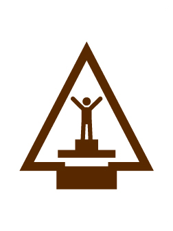

# Race Time AOL Arrow of Light Adventure

- **Adventure name:** Race Time AOL
- **Rank:** Arrow of Light
- **Type:** Elective
- **Category:** 

## Overview

In this Adventure you will design and build your own Pinewood Derby® car or Raingutter Regatta™ boat. As an Arrow of Light Scout, you will mentor younger Cub Scouts on design, building, and good sportsmanship. Prior to any activity, use Scouting America’s SAFE Checklist to ensure the safety of all those involved. All participants in official Scouting America activities should become familiar with the Guide to Safe Scouting and applicable program literature or manuals.

## Requirements

### Requirement 1

With adult supervision, build either a Pinewood Derby® car or a Raingutter Regatta™ boat.

**Activities:**

- **[Pinewood Derby® Car Build Day](https://www.scouting.org/cub-scout-activities/pinewood-derby-car-build-day/)** (Indoor, energy 3, supplies 5, prep 4)
  Den or pack provides a build day for Cub Scouts.
- **[Raingutter Regatta™ Boat Build Day](https://www.scouting.org/cub-scout-activities/raingutter-regatta-boat-build-day/)** (Indoor, energy 3, supplies 2, prep 4)
  Den or pack provides a build day for Cub Scouts.

### Requirement 2

Learn the rules of the race for the vehicle chosen in requirement 1.

**Activities:**

- **[Pinewood Derby® Connect Four](https://www.scouting.org/cub-scout-activities/pinewood-derby-connect-four/)** (Indoor, energy 2, supplies 2, prep 2)
  Learn the rules of the Pinewood Derby® with a game of Connect Four.
- **[Raingutter Regatta™ Connect Four](https://www.scouting.org/cub-scout-activities/raingutter-regatta-connect-four/)** (Indoor, energy 2, supplies 2, prep 2)
  Learn the rules of the Raingutter Regatta™ with a game of Connect Four.

### Requirement 3

Mentor a younger den to prepare for the race.

**Activities:**

- **[Build Day Leader](https://www.scouting.org/cub-scout-activities/build-day-leader/)** (Indoor, energy 1, supplies 1, prep 5)
  Cub Scouts help out on pack build day.
- **[Leading Sportsmanship at the Derby](https://www.scouting.org/cub-scout-activities/leading-sportsmanship-at-the-derby/)** (Indoor, energy 2, supplies 1, prep 1)
  Arrow of Light Cub Scouts teach younger Cub Scouts how to display good sportsmanship.
- **[Leading Sportsmanship at the Regatta](https://www.scouting.org/cub-scout-activities/leading-sportsmanship-at-the-regatta/)** (Indoor, energy 2, supplies 1, prep 1)
  Arrow of Light Cub Scouts teach younger Cub Scouts how to display good sportsmanship.
- **[Race Check-In Support](https://www.scouting.org/cub-scout-activities/race-check-in-support/)** (Indoor, energy 2, supplies 1, prep 5)
  Cub Scouts help out at the vehicle check-in event.

### Requirement 4

Before the race, discuss with your patrol den how you will demonstrate good sportsmanship during the race.

**Activities:**

- **[AOL A Scouts is Kind](https://www.scouting.org/cub-scout-activities/aol-a-scouts-is-kind/)** (Indoor, energy 2, supplies 1, prep 1)
  Cub Scouts discuss good sportsmanship and how to demonstrate it during their racing event.

### Requirement 5

Participate in a Pinewood Derby® or a Raingutter Regatta™.

**Activities:**

- **[Pinewood Derby® Race AOL](https://www.scouting.org/cub-scout-activities/pinewood-derby-race-aol/)** (Indoor, energy 5, supplies 5, prep 5)
  Conduct a Pinewood Derby® car race.
- **[Raingutter Regatta™ AOL](https://www.scouting.org/cub-scout-activities/raingutter-regatta-aol/)** (Outdoor, energy 5, supplies 5, prep 5)
  Conduct a Raingutter Regatta™.

## Resources

- [Race Time AOL Arrow of Light adventure page](https://www.scouting.org/cub-scout-adventures/race-time-aol/)

Note: This is an unofficial archive of Cub Scout Adventures that was automatically extracted from the Scouting America website and may contain errors.