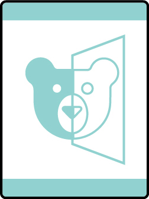

# Balancing Bears Bear Adventure

- **Adventure name:** Balancing Bears
- **Rank:** Bear
- **Type:** Elective
- **Category:** 

## Overview

You are probably familiar with a basic math problem like 3 + 2 = 5. Mathematicians don’t call these problems; they call them equations. The equal sign means that the expressions on the left side and right side of the equal sign are the same, or you could think of them as being balanced. Math doesn’t always involve adding and subtracting numbers. Finding patterns in things is the first step in becoming a mathematician. After spotting a pattern, a mathematician uses the math tools to find a way to recreate that pattern. In this Adventure, you’ll have fun making “trail mix math.” Then, you’ll look to nature and discover a world of mathematics called symmetry in which things are balanced. Prior to any activity, use Scouting America SAFE Checklist to ensure the safety of all those involved.

## Requirements

### Requirement 1

Make trail mix using trail mix math.

**Activities:**

- **[Bear Trail Mix Math](https://www.scouting.org/cub-scout-activities/bear-trail-mix-math/)** (Indoor, energy 2, supplies 3, prep 2)
  Use math to make a bag of trail mix.

### Requirement 2

Identify an animal that has a pattern to its physical appearance. Investigate how the animal uses its pattern.

**Activities:**

- **[Patterns in the Animal World](https://www.scouting.org/cub-scout-activities/patterns-in-the-animal-world/)** (Indoor, energy 1, supplies 1, prep 2)
  Pick an animal with a pattern and learn about it.

### Requirement 3

Find  examples of bilateral symmetry in nature.

**Activities:**

- **[Bilateral Symmetry Hunt](https://www.scouting.org/cub-scout-activities/bilateral-symmetry-hunt/)** (Travel, energy 4, supplies 2, prep 5)
  Find bilateral symmetry in nature using a scavenger hunt.
- **[Bilateral Symmetry Snapshot](https://www.scouting.org/cub-scout-activities/bilateral-symmetry-snapshot/)** (Outdoor, energy 4, supplies 2, prep 5)
  Cub Scouts take a walk and take pictures of things they believe have bilateral symmetry.

### Requirement 4

Find examples of radial symmetry in nature.

**Activities:**

- **[Radial Symmetry Hunt](https://www.scouting.org/cub-scout-activities/radial-symmetry-hunt/)** (Travel, energy 4, supplies 2, prep 5)
  Find radial symmetry in nature using a scavenger hunt.
- **[Radial Symmetry Snapshot](https://www.scouting.org/cub-scout-activities/radial-symmetry-snapshot/)** (Outdoor, energy 4, supplies 2, prep 5)
  Cub Scouts take a walk and take pictures of things they believe have radical symmetry.

## Resources

- [Balancing Bears Bear adventure page](https://www.scouting.org/cub-scout-adventures/balancing-bears/)

Note: This is an unofficial archive of Cub Scout Adventures that was automatically extracted from the Scouting America website and may contain errors.