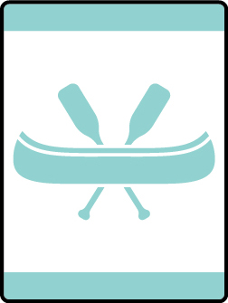

# Bears Afloat Bear Adventure

- **Adventure name:** Bears Afloat
- **Rank:** Bear
- **Type:** Elective
- **Category:** 

## Overview

Adult leaders supervising activities afloat must have completed Safety Afloat training within the previous two years. Cub Scout activities afloat are limited to council, district, pack, or den events on calm or gently flowing water that do not include float trips (expeditions). Safety Afloat standards apply to the use of canoes, kayaks, rowboats, rafts, floating tubes, sailboats, motorboats (including waterskiing), and other small craft (Stand Up Paddle Boards). Grip, shaft, throat, shoulder, blade, and tip are all parts of a paddle. In this Adventure, you’ll discover the world of paddle crafts. Canoes, kayaks, and stand-up paddleboards all rely on you as the source of power. There are places that you can get to only by paddle craft. You will also learn how to be safe when using a paddle craft, from learning about your equipment to proper ways to paddle your craft.

## Requirements

### Requirement 1

Before attempting requirements 6 and 7 for this Adventure, you must pass Scouting America swimmer test.

**Activities:**

- **[Swimmers Test](https://www.scouting.org/cub-scout-activities/swimmers-test/)** (Travel, energy 5, supplies 4, prep 3)
  Cub Scouts swim for the Scouting America swimmer test.

### Requirement 2

Pick a paddle craft you’ll use to complete all requirements: canoe, kayak, or stand-up paddleboard.

**Activities:**

- **[Picking Paddle Craft](https://www.scouting.org/cub-scout-activities/picking-paddle-craft/)** (Indoor, energy 1, supplies 5, prep 4)
  Cub Scouts pick from one of the paddle crafts to complete remaining requirements.

### Requirement 3

With your den or an adult, discuss the role of qualified adult supervision at a paddle craft activity.

**Activities:**

- **[Qualified Supervision](https://www.scouting.org/cub-scout-activities/qualified-supervision/)** (Indoor, energy 1, supplies 1, prep 2)
  Cub Scouts identify the attributes of a qualified adult at a boating activity.

### Requirement 4

Explain the safety rules to follow when safely using a paddle craft.

**Activities:**

- **[Paddling Safely Rule Game](https://www.scouting.org/cub-scout-activities/paddling-safely-rule-game/)** (Indoor, energy 1, supplies 1, prep 2)
  Cub Scouts learn the safety rules to follow when using a paddle craft.

### Requirement 5

Discover how to tell if a life jacket is the correct size and approved for your paddle craft activity. Demonstrate how to wear it.

**Activities:**

- **[Life Jacket Education](https://www.scouting.org/cub-scout-activities/life-jacket-education/)** (Indoor, energy 2, supplies 5, prep 2)
  Cub Scouts learn about life jackets.

### Requirement 6

Explore how your paddle craft responds as you move your paddle through the water from different places.

**Activities:**

- **[Paddle Practice](https://www.scouting.org/cub-scout-activities/paddle-practice/)** (Travel, energy 5, supplies 5, prep 5)
  Cub Scouts practice paddling strokes.

### Requirement 7

Have 30 minutes, or more, of canoe, kayak, or stand-up paddleboard paddle time.

**Activities:**

- **[Paddling Around for Fun](https://www.scouting.org/cub-scout-activities/paddling-around-for-fun/)** (Travel, energy 5, supplies 5, prep 5)
  Cub Scouts enjoy 30 minutes of paddle craft activity.

## Resources

- [Bears Afloat Bear adventure page](https://www.scouting.org/cub-scout-adventures/bears-afloat/)

Note: This is an unofficial archive of Cub Scout Adventures that was automatically extracted from the Scouting America website and may contain errors.