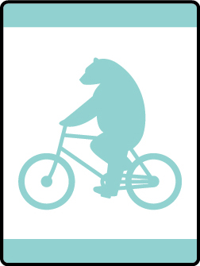

# Bears on Bikes Bear Adventure

- **Adventure name:** Bears on Bikes
- **Rank:** Bear
- **Type:** Elective
- **Category:** 

## Overview

Get together with your den, pack, or family to go on a bike ride. In this Adventure, you’ll learn what to wear to ride your bike safely and some basic maintenance. Then get ready for a bike ride. Grab your helmet, check your tires, and take a buddy to head out on another Cub Scout Adventure. Prior to any activity, use Scouting America SAFE Checklist to ensure the safety of all those involved. All participants in official Scouting America activities should become familiar with the Guide to Safe Scouting and applicable program literature or manuals.

## Requirements

### Requirement 1

Show how to properly wear a bicycle helmet.

**Activities:**

- **[Helmet Relay](https://www.scouting.org/cub-scout-activities/helmet-relay/)** (Outdoor, energy 4, supplies 2, prep 2)
  Cub Scouts  demonstrate  proper helmet fitting during a relay game.

### Requirement 2

Decide what you should wear when riding a bike.

**Activities:**

- **[Dress the Cub Scout](https://www.scouting.org/cub-scout-activities/dress-the-cub-scout/)** (Outdoor, energy 3, supplies 3, prep 3)
  Cub Scouts learn proper bike attire by playing a game.

### Requirement 4

Demonstrate how to adjust saddle height.

**Activities:**

- **[Saddle Up](https://www.scouting.org/cub-scout-activities/saddle-up/)** (Outdoor, energy 2, supplies 2, prep 4)
  Cub Scouts  demonstrate  how to adjust a bike seat.

### Requirement 5

Demonstrate how to operate brakes.

**Activities:**

- **[Brake Test](https://www.scouting.org/cub-scout-activities/brake-test/)** (Outdoor, energy 5, supplies 4, prep 4)
  Cub Scouts  demonstrate  how to  operate  their bicycle brakes.

### Requirement 6

Learn how to use a pump to inflate your tires. Discuss why riding with low-pressure or flat tires is unsafe and can cause damage to your bike.

**Activities:**

- **[Pump It Up](https://www.scouting.org/cub-scout-activities/pump-it-up/)** (Outdoor, energy 3, supplies 4, prep 3)
  Cub Scouts learn how to pump up their tires safely.

### Requirement 7

With your family, den, or pack, follow the buddy system and go on a 30-minute bike ride.

**Activities:**

- **[Bear Bike Ride](https://www.scouting.org/cub-scout-activities/bear-bike-ride/)** (Travel, energy 5, supplies 5, prep 5)
  Cub Scouts go on a 30-minute bike ride while using the buddy system.

## Resources

- [Bears on Bikes Bear adventure page](https://www.scouting.org/cub-scout-adventures/bears-on-bikes/)

Note: This is an unofficial archive of Cub Scout Adventures that was automatically extracted from the Scouting America website and may contain errors.