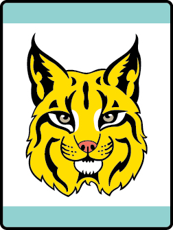

# Bobcat Bear Bear Adventure

- **Adventure name:** Bobcat Bear
- **Rank:** Bear
- **Type:** Required
- **Category:** Character & Leadership

## Overview

The Bobcat Adventure is the first required Adventure on the trail to earn the Bear badge of rank. Once the Bobcat Adventure is completed, Bears can start any other of the Adventures in any order. Prior to any activity, use Scouting America SAFE Checklist to ensure the safety of all those involved. All participants in official Scouting America activities should become familiar with the Guide to Safe Scouting and applicable program literature or manuals.

## Requirements

### Requirement 1

Get to know members of your den.

**Activities:**

- **[Bear Line Up](https://www.scouting.org/cub-scout-activities/bear-line-up/)** (Indoor, energy 3, supplies 1, prep 1)
  With this icebreaker game, get your den communicating as they work together to put themselves in line.
- **[Den Doodle Bear](https://www.scouting.org/cub-scout-activities/den-doodle-bear/)** (Indoor, energy 2, supplies 4, prep 4)
  Create a den doodle to record advancement progress and other accomplishments .
- **[Den Flag Bear](https://www.scouting.org/cub-scout-activities/den-flag-bear/)** (Indoor, energy 2, supplies 4, prep 3)
  Create a den flag that allows Cub Scouts to show their personality and creativity while getting to know each other.

### Requirement 2

Recite the Scout Oath and Law with your den and den leader.

**Activities:**

- **[Bobcat Beanbag Toss](https://www.scouting.org/cub-scout-activities/bobcat-beanbag-toss/)** (Indoor, energy 4, supplies 3, prep 3)
  While tossing bean bags,  Cub Scouts are moving while learning the Scout Law.
- **[Recite the Oath and Law Bear](https://www.scouting.org/cub-scout-activities/recite-the-oath-and-law-bear/)** (Indoor, energy 1, supplies 1, prep 1)
  Recite the Scout Oath and Scout Law with the den.
- **[Scout Law Hop](https://www.scouting.org/cub-scout-activities/scout-law-hop/)** (Indoor, energy 4, supplies 2, prep 2)
  Cub Scouts learn the Scout Law by playing a hopping game.

### Requirement 3

Learn about the Scout Oath. Identify the three points of the Scout Oath.

**Activities:**

- **[Bear Charades](https://www.scouting.org/cub-scout-activities/bear-charades/)** (Indoor, energy 3, supplies 2, prep 2)
  Using charades, Cub Scouts act out the three points of the Scout Oath.
- **[Lights, Camera, Action](https://www.scouting.org/cub-scout-activities/lights-camera-action/)** (Indoor, energy 3, supplies 2, prep 2)
  Cub Scouts work together to create a photo or video demonstrating one of the three points of the Scout Oath.
- **[Scout Oath Poster](https://www.scouting.org/cub-scout-activities/scout-oath-poster/)** (Indoor, energy 2, supplies 2, prep 1)
  Create a poster of the Scout Oath.

### Requirement 4

With your den create a den Code of Conduct.

**Activities:**

- **[Code of Conduct Bear](https://www.scouting.org/cub-scout-activities/code-of-conduct-bear/)** (Indoor, energy 1, supplies 2, prep 2)
  Cub Scouts will be invested in their own conduct when they help create their den code of conduct.

### Requirement 5

Learn about the denner position and responsibilities.

**Activities:**

- **[A Bear Denner](https://www.scouting.org/cub-scout-activities/a-bear-denner/)** (Indoor, energy 1, supplies 2, prep 2)
  Use popsicle sticks to pick the den meeting denner.
- **[Denner Jobs](https://www.scouting.org/cub-scout-activities/denner-jobs/)** (Indoor, energy 2, supplies 2, prep 2)
  Working together, Cub Scouts make a chart of denner responsibilities.

### Requirement 6

Demonstrate the Cub Scout sign, Cub Scout salute, and Cub Scout handshake.  Show how each is used.

**Activities:**

- **[Bobcat Relay Bear](https://www.scouting.org/cub-scout-activities/bobcat-relay-bear/)** (Indoor, energy 3, supplies 1, prep 1)
  In this Cub Scout relay game, teams show the Cub Scout sign, salute, and handshake.
- **[Flag Opening](https://www.scouting.org/cub-scout-activities/flag-opening/)** (Indoor, energy 2, supplies 1, prep 1)
  Participate in an opening ceremony that includes the use the Cub Scout salute, sign, and handshake.

### Requirement 7

Share with your den, or family, a time when you demonstrated the Cub Scout motto “Do Your Best.” Explain why it is important to do your best.

**Activities:**

- **[Do Your Best Showcase](https://www.scouting.org/cub-scout-activities/do-your-best-showcase-2/)** (Indoor, energy 1, supplies 1, prep 1)
  Cub Scouts share a time when they did their best.

### Requirement 8

At home, with your parent or legal guardian do the activities in the booklet “How to Protect Your Children from Child Abuse: A Parent’s Guide.”

**Activities:**

- **[Child Abuse Protection Review Bear](https://www.scouting.org/cub-scout-activities/child-abuse-protection-review-bear/)** (Indoor, energy 1, supplies 1, prep 1)
  Review the activities in the booklet “How to Protect Your Children from Child Abuse: A Parent’s Guide.”

## Resources

- [Bobcat Bear Bear adventure page](https://www.scouting.org/cub-scout-adventures/bobcat-bear/)

Note: This is an unofficial archive of Cub Scout Adventures that was automatically extracted from the Scouting America website and may contain errors.