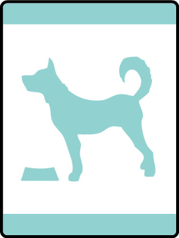

# Critter Care Bear Adventure

- **Adventure name:** Critter Care
- **Rank:** Bear
- **Type:** Elective
- **Category:** 

## Overview

Many Americans have a pet dog, cat, horse, bird, fish, hamster, or other animal. The most popular pet is a dog. Almost one out of three American households have a dog as a pet. One out of four have a cat as a pet. Pets are fun, but they are also a big responsibility. Pets need food, water, shelter, and exercise to stay healthy. When you look after a pet, whether it belongs to you or a neighbor, you learn a lot about love, loyalty, and caring. Learning to look after pets — and having fun with them — is what this Adventure is all about. Prior to any activity, use Scouting America SAFE Checklist to ensure the safety of all those involved.

## Requirements

### Requirement 1

Identify an animal that would be good pet for your family.

**Activities:**

- **[My Pet](https://www.scouting.org/cub-scout-activities/my-pet/)** (Indoor, energy 1, supplies 1, prep 1)
  Cub Scouts describe their pet or the pet they would like to have.
- **[Pet Savers](https://www.scouting.org/cub-scout-activities/pet-savers/)** (Travel, energy 3, supplies 1, prep 5)
  Visit a local animal shelter and identify an animal that could make for a good family pet.
- **[Pets, So Many](https://www.scouting.org/cub-scout-activities/pets-so-many/)** (Indoor, energy 1, supplies 2, prep 2)
  Cub Scouts explore what animal would make for a good family pet.

### Requirement 2

Choose two animals that are allowed as pets in your community.  Compare and contrast why these pets may be a good choice for you.

**Activities:**

- **[Help Me Choose](https://www.scouting.org/cub-scout-activities/help-me-choose/)** (Indoor, energy 2, supplies 2, prep 3)
  Cub Scouts compare and contrast two animals that are allowed in their community.
- **[Poster Pet](https://www.scouting.org/cub-scout-activities/poster-pet/)** (Indoor, energy 2, supplies 4, prep 2)
  Cub Scouts will choose two pets that are allowed in their community and create a compare and contrast chart.
- **[What Animal](https://www.scouting.org/cub-scout-activities/what-animal/)** (Indoor, energy 4, supplies 2, prep 2)
  Cub Scouts choose an animal that is allowed in their community and present a charades-act of that animal.

### Requirement 3

Based on your choice in requirement 1, investigate how to properly care for your chosen animal.

**Activities:**

- **[Pet Responsibilities](https://www.scouting.org/cub-scout-activities/pet-responsibilities/)** (Indoor, energy 2, supplies 3, prep 2)
  Cub Scouts describe the responsibilities, care, and activities that are required for the family pet or an animal that would make for a good family pet.
- **[Shelter Visits](https://www.scouting.org/cub-scout-activities/shelter-visits/)** (Travel, energy 3, supplies 1, prep 5)
  Cub Scouts investigate how to properly care for pets by visiting an animal shelter.
- **[Trainer Visits](https://www.scouting.org/cub-scout-activities/trainer-visits/)** (Indoor, energy 3, supplies 1, prep 5)
  Cub Scouts investigate how to properly care for pets by visiting with an animal trainer.
- **[Veterinarian Visits](https://www.scouting.org/cub-scout-activities/veterinarian-visits/)** (Indoor, energy 3, supplies 1, prep 5)
  Cub Scouts investigate how to properly care for pets by visiting with a veterinarian.

### Requirement 4

Discover three ways a pet can help people.

**Activities:**

- **[Animal Helpers](https://www.scouting.org/cub-scout-activities/animal-helpers/)** (Indoor, energy 2, supplies 4, prep 2)
  Cub Scouts create a PowerPoint presentation showing three ways a pet can help people.
- **[Animal Partner](https://www.scouting.org/cub-scout-activities/animal-partner/)** (Indoor, energy 3, supplies 2, prep 5)
  Invite a professional who has an animal as a partner to discuss their partnership and roles.
- **[Service Animals](https://www.scouting.org/cub-scout-activities/service-animals/)** (Indoor, energy 3, supplies 1, prep 5)
  Cub Scouts explore why service animals are important.

## Resources

- [Critter Care Bear adventure page](https://www.scouting.org/cub-scout-adventures/critter-care/)

Note: This is an unofficial archive of Cub Scout Adventures that was automatically extracted from the Scouting America website and may contain errors.