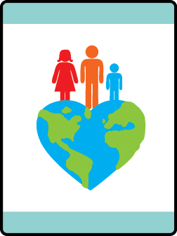

# Paws for Action Bear Adventure

- **Adventure name:** Paws for Action
- **Rank:** Bear
- **Type:** Required
- **Category:** Citizenship

## Overview

This Adventure is about America and the powerful symbols that represent the best of our country and how communities come together to help solve problems they are facing.  Citizenship in America is about participation.  One way to show citizenship is by making an impact locally through nonprofit organizations.  Nonprofit organizations are a place for people to give their time, talents, and resources to make a difference in their community.  You, too, can make an impact by participating in a service project that makes your community a better place. Prior to any activity, use Scouting America SAFE Checklist to ensure the safety of all those involved. All participants in official Scouting America activities should become familiar with the Guide to Safe Scouting and applicable program literature or manuals.

## Requirements

### Requirement 1

Familiarize yourself with the flag of the United States of America including the history, demonstrating how to raise and lower the flag, how to properly fold and display, and the United States etiquette.

**Activities:**

- **[Outdoor Flag Ceremony](https://www.scouting.org/cub-scout-activities/outdoor-flag-ceremony/)** (Outdoor, energy 3, supplies 4, prep 3)
  Learn about flag etiquette and how to work with a flag while playing a flag trivia game.
- **[Patriotic Guest Speaker](https://www.scouting.org/cub-scout-activities/patriotic-guest-speaker/)** (Indoor, energy 2, supplies 2, prep 3)
  Learn about the United States flag and how it’s used from a local patriot.

### Requirement 2

Identify 3 symbols that represent the United States. Pick your favorite and make a model, work of art, or other craft that depicts the symbol.

**Activities:**

- **[Paint the Flag](https://www.scouting.org/cub-scout-activities/paint-the-flag/)** (Indoor, energy 3, supplies 3, prep 3)
  Paint a picture of the United States  flag.
- **[Statue of Liberty](https://www.scouting.org/cub-scout-activities/statue-of-liberty/)** (Indoor, energy 3, supplies 3, prep 3)
  Learn about the Statue of Liberty while building a replica.
- **[U.S.A. Symbol Model](https://www.scouting.org/cub-scout-activities/u-s-a-symbol-model/)** (Indoor, energy 3, supplies 3, prep 2)
  Using Play-Doh​​®, create a symbol that represents the United States.
- **[U.S.A. Symbols Drawing](https://www.scouting.org/cub-scout-activities/u-s-a-symbols-drawing/)** (Indoor, energy 3, supplies 2, prep 2)
  Learn about symbols that represent the United States and create a drawing of your favorite symbol.
- **[White House Model](https://www.scouting.org/cub-scout-activities/white-house-model/)** (Indoor, energy 3, supplies 3, prep 2)
  Learn about United States symbols and build a model of the White House.

### Requirement 3

Learn about the mission of any non-profit.  Find out how they fund their activities and how volunteers are used to help.

**Activities:**

- **[Groups That Help](https://www.scouting.org/cub-scout-activities/groups-that-help/)** (Indoor, energy 1, supplies 2, prep 2)
  Cub Scouts learn about a nonprofit organization using the internet.
- **[Nonprofit Visit](https://www.scouting.org/cub-scout-activities/nonprofit-visit/)** (Travel, energy 1, supplies 1, prep 5)
  Cub Scouts learn about a nonprofit by visiting the organization.

### Requirement 4

Participate in a service project.

**Activities:**

- **[Eyeglasses Donation Drive](https://www.scouting.org/cub-scout-activities/eyeglasses-donation-drive/)** (Indoor, energy 3, supplies 3, prep 5)
  With your den, host a used eyeglasses drive to donate to an organization that recycles them for those in need.
- **[Plant Trees](https://www.scouting.org/cub-scout-activities/plant-trees/)** (Travel, energy 4, supplies 5, prep 4)
  Cub Scouts plant a tree in their community.
- **[Scouting for Food Bear](https://www.scouting.org/cub-scout-activities/scouting-for-food-bear/)** (Travel, energy 3, supplies 1, prep 5)
  Participate in your Council-sponsored Scouting for Food event.

## Resources

- [Paws for Action Bear adventure page](https://www.scouting.org/cub-scout-adventures/paws-for-action/)

Note: This is an unofficial archive of Cub Scout Adventures that was automatically extracted from the Scouting America website and may contain errors.