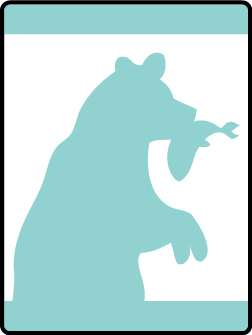

# Salmon Run Bear Adventure

- **Adventure name:** Salmon Run
- **Rank:** Bear
- **Type:** Elective
- **Category:** 

## Overview

Did you know that nearly three-fourths of the Earth is covered by water? It is! If you want to explore a lot of the world, you have to go by boat or know how to swim. Grizzly bears are animals that know how to swim even though they live in the forest. They swim in ice-cold rivers to catch the salmon they eat. As a Bear Scout, you will get to go swimming, too – not to catch fish, but to have fun. In this Adventure, you’ll learn about swimming and boating and how to stay safe around the water. This elective Adventure may be earned by completing the requirements below OR passing Scouting America swimmer test OR taking swimming lessons. Prior to any activity, use Scouting America SAFE Checklist to ensure the safety of all those involved.

## Requirements

### Requirement 1

With your den or an adult, identify the attributes of qualified adult supervision at a swimming activity.

**Activities:**

- **[Qualified Supervision Bear](https://www.scouting.org/cub-scout-activities/qualified-supervision-bear/)** (Indoor, energy 1, supplies 1, prep 2)
  Cub Scouts identify the attributes of a qualified adult at a swimming activity.

### Requirement 2

Learn the three swimming ability groups for Scouting America and water depths appropriate for each.

**Activities:**

- **[Swimming Skills Set](https://www.scouting.org/cub-scout-activities/swimming-skills-set/)** (Indoor, energy 1, supplies 1, prep 2)
  Cub Scouts learn the three swimming ability groups of Scouting America.

### Requirement 3

Go swimming with your den, pack, or family for 30 minutes using the buddy system.

**Activities:**

- **[Go Swimming Bear](https://www.scouting.org/cub-scout-activities/go-swimming-bear/)** (Travel, energy 5, supplies 5, prep 5)
  Take your den and go swimming.

### Requirement 4

Demonstrate the use the buddy system, buddy checks, and ability groups with your den or an adult.

**Activities:**

- **[Buddies in Swimming](https://www.scouting.org/cub-scout-activities/buddies-in-swimming/)** (Travel, energy 4, supplies 3, prep 3)
  Cub Scouts demonstrate the use of the buddy system, buddy checks, and ability groups.

### Requirement 5

Attempt Scouting America beginner swim test.

**Activities:**

- **[Beginner Swim Test](https://www.scouting.org/cub-scout-activities/beginner-swim-test/)** (Travel, energy 5, supplies 4, prep 2)
  Cub Scouts attempt the Scouting America beginner swim test.

### Requirement 6

Demonstrate both a reach rescue and a throw rescue.

**Activities:**

- **[Reach and Throw Rescue](https://www.scouting.org/cub-scout-activities/reach-and-throw-rescue/)** (Travel, energy 4, supplies 3, prep 2)
  Cub Scouts demonstrate the reach rescue and throw rescue.

## Resources

- [Salmon Run Bear adventure page](https://www.scouting.org/cub-scout-adventures/salmon-run/)

Note: This is an unofficial archive of Cub Scout Adventures that was automatically extracted from the Scouting America website and may contain errors.