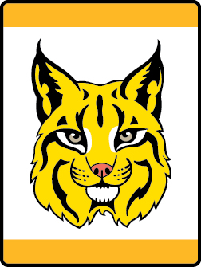

# Bobcat Lion Lion Adventure

- **Adventure name:** Bobcat Lion
- **Rank:** Lion
- **Type:** Required
- **Category:** Character & Leadership

## Overview

The Bobcat Adventure is the first required Adventure on the trail to earn the Lion badge of rank.  Once the Bobcat Adventure is completed, Lions can start any other of the Adventures in any order. Prior to any activity, use Scouting America SAFE Checklist to ensure the safety of all those involved. All participants in official Scouting America activities should become familiar with the Guide to Safe Scouting and applicable program literature or manuals.

## Requirements

### Requirement 1

Get to know the members of your den.

**Activities:**

- **[Den Doodle Lion](https://www.scouting.org/cub-scout-activities/den-doodle-lion/)** (Indoor, energy 3, supplies 4, prep 4)
  The den doodle is a craft project that can be used to track attendance, reward good behavior, and completion of requirements.
- **[Den Flag Lion](https://www.scouting.org/cub-scout-activities/den-flag-lion/)** (Indoor, energy 2, supplies 4, prep 4)
  A den flag is a craft that can bring your den together by getting to know everyone’s name and having a symbol that everyone has a part in making.
- **[Hand Puppet Introductions](https://www.scouting.org/cub-scout-activities/hand-puppet-introductions/)** (Indoor, energy 2, supplies 2, prep 2)
  Cub Scouts and adult partners make hand puppets that reflect themselves and use the puppets to share about themselves.
- **[Lions Talk and Lions Listen](https://www.scouting.org/cub-scout-activities/lions-talk-and-lions-listen/)** (Indoor, energy 2, supplies 2, prep 1)
  The Cub Scout sign is a way to help Cub Scouts learn good manners and communication skills.
- **[The Wigalo Song](https://www.scouting.org/cub-scout-activities/the-wigalo-song/)** (Indoor, energy 3, supplies 2, prep 2)
  Sing the Wigalo Song to get to know everyone’s name.

### Requirement 2

Have your Lion adult partner or den leader read the Scout Law to you. Demonstrate your understanding of being friendly.

**Activities:**

- **[Friendship Zipper Pull](https://www.scouting.org/cub-scout-activities/friendship-zipper-pull/)** (Indoor, energy 2, supplies 2, prep 2)
  Cub Scouts will make a friendship zipper pull for another Cub Scout.
- **[The Colorful Scout Law](https://www.scouting.org/cub-scout-activities/the-colorful-scout-law/)** (Indoor, energy 2, supplies 2, prep 2)
  Coloring activity for the Scout Law.
- **[The Compliment Game](https://www.scouting.org/cub-scout-activities/the-compliment-game/)** (Indoor, energy 1, supplies 2, prep 1)
  Everyone pays a compliment to each other in a game.

### Requirement 3

Share with your Lion adult partner, during a den meeting or at home, a time when you have demonstrated the Cub Scout motto “Do Your Best.”

**Activities:**

- **[When Am I Doing My Best?](https://www.scouting.org/cub-scout-activities/when-am-i-doing-my-best/)** (Indoor, energy 2, supplies 2, prep 2)
  Activity to help Cub Scouts identify what it means to do their best.

### Requirement 4

At home, with your parent or legal guardian, do the activities in the booklet “How to Protect Your Children from Child Abuse: A Parent’s Guide.”

**Activities:**

- **[Child Abuse Protection Review Lion](https://www.scouting.org/cub-scout-activities/child-abuse-protection-review-lion/)** (Indoor, energy 1, supplies 2, prep 1)
  Review the activities in the booklet “How to Protect Your Children from Child Abuse: A Parent’s Guide.”

## Resources

- [Bobcat Lion Lion adventure page](https://www.scouting.org/cub-scout-adventures/bobcat-lion/)

Note: This is an unofficial archive of Cub Scout Adventures that was automatically extracted from the Scouting America website and may contain errors.