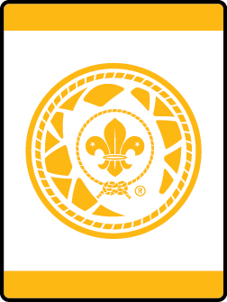

# Champions for Nature Lion Lion Adventure

- **Adventure name:** Champions for Nature Lion
- **Rank:** Lion
- **Type:** Elective
- **Category:** 

## Overview

As part of the World Organization of the Scouting Movement, this program is part of a global effort to teach youth about the conservation of natural resources.  This includes participating in a service project. Prior to any activity, use Scouting America SAFE Checklist to ensure the safety of all those involved. All participants in official Scouting America activities should become familiar with the Guide to Safe Scouting and applicable program literature or manuals.

## Requirements

### Requirement 1

Discover the difference between natural resources and man-made items.

**Activities:**

- **[Match Natural and Man-made](https://www.scouting.org/cub-scout-activities/match-natural-and-man-made/)** (Indoor, energy 2, supplies 2, prep 1)
  Identify pictures of things that are natural and things that are man-made.
- **[Natural to Man-made](https://www.scouting.org/cub-scout-activities/natural-to-man-made/)** (Indoor, energy 2, supplies 3, prep 2)
  Identity items that are man-made but made from natural items.
- **[Sorting Natural Items](https://www.scouting.org/cub-scout-activities/sorting-natural-items/)** (Indoor, energy 4, supplies 4, prep 2)
  Play a sorting game of items that are natural and items that are man-made.

### Requirement 2

Discover the difference between organic, paper, plastic, metal and glass waste.

**Activities:**

- **[Types of Trash](https://www.scouting.org/cub-scout-activities/types-of-trash/)** (Indoor, energy 2, supplies 2, prep 1)
  Identify the difference between items that are organic, paper, and glass.

### Requirement 4

Participate in a conservation service project.

**Activities:**

- **[Clean Waterways](https://www.scouting.org/cub-scout-activities/clean-waterways-lion/)** (Outdoor, energy 4, supplies 3, prep 5)
  In celebration of the 70th anniversary of the Conservation Good Turn for America, Scouting America is joining the nationwide initiative aimed at addressing the critical issue of waterway and marine debris, “aquatic trash”, offering Scouts the opportunity to make a meaningful impact on the health of our waterways and ecosystems.
- **[Dinner Time for Bees](https://www.scouting.org/cub-scout-activities/dinner-time-for-bees/)** (Outdoor, energy 4, supplies 4, prep 5)
  Plant native plants that attract bees.
- **[Sowing The Seeds of Love](https://www.scouting.org/cub-scout-activities/sowing-the-seeds-of-love/)** (Outdoor, energy 2, supplies 3, prep 2)
  Make “seed bombs” to plant wildflowers.

## Resources

- [Champions for Nature Lion Lion adventure page](https://www.scouting.org/cub-scout-adventures/champions-for-nature-lion/)

Note: This is an unofficial archive of Cub Scout Adventures that was automatically extracted from the Scouting America website and may contain errors.