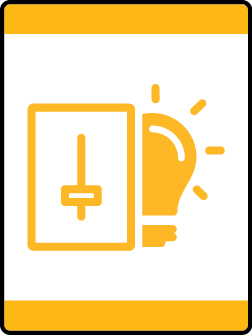

# Everyday Tech Lion Adventure

- **Adventure name:** Everyday Tech
- **Rank:** Lion
- **Type:** Elective
- **Category:** 

## Overview

Explore how technology has made life easier and the ways to use technology safely. Prior to any activity, use Scouting America SAFE Checklist to ensure the safety of all those involved. All participants in official Scouting America activities should become familiar with the Guide to Safe Scouting and applicable program literature or manuals.

## Requirements

### Requirement 1

Discover technology around your home, meeting place, or neighborhood.

**Activities:**

- **[“I Spy” Technology](https://www.scouting.org/cub-scout-activities/i-spy-technology/)** (Indoor, energy 2, supplies 1, prep 1)
  Play a game of “I Spy” to identify everyday technology.
- **[What is Technology?](https://www.scouting.org/cub-scout-activities/what-is-technology/)** (Indoor, energy 2, supplies 2, prep 1)
  Identify objects that are technology and those that are not.

### Requirement 2

Discover ways that digital technology can make life easier.

**Activities:**

- **[Grocery Shopping Tech](https://www.scouting.org/cub-scout-activities/grocery-shopping-tech/)** (Travel, energy 3, supplies 4, prep 3)
  Use a grocery store app for a scaventer hunt in the grocery store.
- **[Making Life Easier](https://www.scouting.org/cub-scout-activities/making-life-easier/)** (Indoor, energy 2, supplies 2, prep 1)
  Identify how technology has made life easier.
- **[Technology Memory Game](https://www.scouting.org/cub-scout-activities/technology-memory-game/)** (Indoor, energy 2, supplies 2, prep 2)
  Play a game of memory that matches old technology with new technology.

### Requirement 3

Identify an item of digital technology you use at home. Demonstrate to your Lion adult partner how you use it safely.

**Activities:**

- **[Be Safe with Technology Lion](https://www.scouting.org/cub-scout-activities/be-safe-with-technology-lion/)** (Indoor, energy 1, supplies 1, prep 1)
  Cub Scouts create rules for the use of digital devices.

## Resources

- [Everyday Tech Lion adventure page](https://www.scouting.org/cub-scout-adventures/everyday-tech/)

Note: This is an unofficial archive of Cub Scout Adventures that was automatically extracted from the Scouting America website and may contain errors.