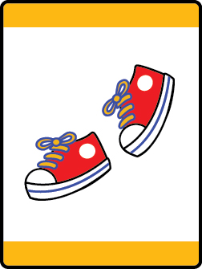

# Fun on the Run Lion Adventure

- **Adventure name:** Fun on the Run
- **Rank:** Lion
- **Type:** Required
- **Category:** Personal Fitness

## Overview

In this Adventure, Lions will explore the different food groups, have fun being active, and the importance of rest. Prior to any activity, use Scouting America SAFE Checklist to ensure the safety of all those involved. All participants in official Scouting America activities should become familiar with the Guide to Safe Scouting and applicable program literature or manuals.

## Requirements

### Requirement 1

Identify the five different food groups.

**Activities:**

- **[Snack Time](https://www.scouting.org/cub-scout-activities/snack-time/)** (Indoor, energy 2, supplies 4, prep 5)
  Cub Scouts bring and share their favorite food from one of the five food groups.
- **[That Food is in the Wrong Group](https://www.scouting.org/cub-scout-activities/that-food-is-in-the-wrong-group/)** (Indoor, energy 2, supplies 2, prep 2)
  Activity for Cub Scouts to identify food groups and what doesn’t belong.
- **[What Food Group Do I Belong To?](https://www.scouting.org/cub-scout-activities/what-food-group-do-i-belong-to/)** (Indoor, energy 4, supplies 4, prep 3)
  Use play food to help Cub Scouts identify the five different food groups.

### Requirement 2

Practice hand washing. Point out when you should wash your hands.

**Activities:**

- **[Bubbles Good Clean Fun](https://www.scouting.org/cub-scout-activities/bubbles-good-clean-fun/)** (Outdoor, energy 4, supplies 2, prep 3)
  Cub Scouts pop bubbles and wash their hands.
- **[Happy Birthday Clean Hands](https://www.scouting.org/cub-scout-activities/happy-birthday-clean-hands/)** (Indoor, energy 2, supplies 2, prep 1)
  Practice handwashing and learn to wash your hands while singing happy birthday.
- **[Steps To Washing Your Hands](https://www.scouting.org/cub-scout-activities/steps-to-wash-your-hands/)** (Indoor, energy 2, supplies 2, prep 3)
  Practice handwashing and put the steps to washing hands in the right order.

### Requirement 3

Be active for 20 minutes.

**Activities:**

- **[It’s Time for Lions to Dance](https://www.scouting.org/cub-scout-activities/its-time-for-lions-to-dance/)** (Indoor, energy 4, supplies 2, prep 2)
  Have a dance party with Cub Scouts and adult partners.
- **[Lion Freeze Tag](https://www.scouting.org/cub-scout-activities/lion-freeze-tag/)** (Outdoor, energy 5, supplies 2, prep 1)
  Play a game of Freeze Tag.
- **[Lion Says](https://www.scouting.org/cub-scout-activities/lion-says/)** (Indoor, energy 3, supplies 1, prep 1)
  Play a game of Simon Says.

### Requirement 4

Practice methods that help you rest.

**Activities:**

- **[Animals Sleep Just Like Me](https://www.scouting.org/cub-scout-activities/animals-sleep-just-like-me/)** (Indoor, energy 2, supplies 2, prep 1)
  Learn that animals sleep and rest too, but some do so during the day and some during the night.
- **[Music Can Soothe the Savage Beast](https://www.scouting.org/cub-scout-activities/music-can-soothe-the-savage-beast/)** (Indoor, energy 2, supplies 3, prep 3)
  Learn how music can influence your ability to rest and relax.
- **[What Time is Bedtime?](https://www.scouting.org/cub-scout-activities/what-time-is-bedtime/)** (Indoor, energy 1, supplies 2, prep 1)
  Adult partners work with Cub Scouts to establish good bedtime habits.

## Resources

- [Fun on the Run Lion adventure page](https://www.scouting.org/cub-scout-adventures/fun-on-the-run/)

Note: This is an unofficial archive of Cub Scout Adventures that was automatically extracted from the Scouting America website and may contain errors.