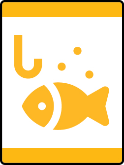

# Go Fish Lion Adventure

- **Adventure name:** Go Fish
- **Rank:** Lion
- **Type:** Elective
- **Category:** 

## Overview

Lions and adult partners will have a great time fishing together. Prior to any activity, use Scouting America SAFE Checklist to ensure the safety of all those involved. All participants in official Scouting America activities should become familiar with the Guide to Safe Scouting and applicable program literature or manuals.

## Requirements

### Requirement 1

With your Lion adult partner, learn the rules of fishing safely.

**Activities:**

- **[Lions Fish Safely](https://www.scouting.org/cub-scout-activities/lions-fish-safely/)** (Indoor, energy 2, supplies 2, prep 1)
  Learn the rules to fishing safely.
- **[Safe or Not Safe Fishing Rules](https://www.scouting.org/cub-scout-activities/safe-or-not-safe-fishing-rules/)** (Indoor, energy 1, supplies 2, prep 1)
  After reviewing the safety rules, use a quiz to see what Cub Scouts have learned.

### Requirement 2

Draw a picture of the type of fish you think lives in the water where you are going fishing.

**Activities:**

- **[Drawing Fish With A Grid](https://www.scouting.org/cub-scout-activities/drawing-fish-with-a-grid/)** (Indoor, energy 2, supplies 2, prep 2)
  Learn to draw a fish by using the grid method.

### Requirement 3

Go fishing with your Lion adult partner.

**Activities:**

- **[Lion Go Fishing](https://www.scouting.org/cub-scout-activities/lion-go-fishing/)** (Travel, energy 4, supplies 5, prep 5)
  Go fishing with your adult partner.

## Resources

- [Go Fish Lion adventure page](https://www.scouting.org/cub-scout-adventures/go-fish/)

Note: This is an unofficial archive of Cub Scout Adventures that was automatically extracted from the Scouting America website and may contain errors.