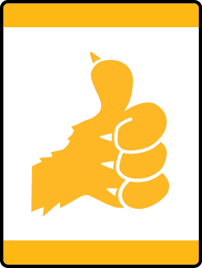

# I’ll Do It Myself Lion Adventure

- **Adventure name:** I’ll Do It Myself
- **Rank:** Lion
- **Type:** Elective
- **Category:** 

## Overview

Establishing good habits of hygiene and self-reliance is the focus of this Adventure. Prior to any activity, use Scouting America SAFE Checklist to ensure the safety of all those involved. All participants in official Scouting America activities should become familiar with the Guide to Safe Scouting and applicable program literature or manuals.

## Requirements

### Requirement 1

Make and use a “lion bag” for personal Scouting gear.

**Activities:**

- **[Decorating My Lion Bag](https://www.scouting.org/cub-scout-activities/decorating-my-lion-bag/)** (Indoor, energy 2, supplies 3, prep 2)
  Decorate reusable shopping bag to make a Lion bag.
- **[My Lion Bag](https://www.scouting.org/cub-scout-activities/my-lion-bag/)** (Indoor, energy 2, supplies 3, prep 3)
  Make a Lion bag for your Cub Scout goodies.

### Requirement 2

Construct a personal care checklist.

**Activities:**

- **[My Lion Morning and Evening](https://www.scouting.org/cub-scout-activities/my-lion-morning-and-evening/)** (Indoor, energy 2, supplies 2, prep 2)
  Complete a morning and evening personal care routine chart.
- **[The Doctor Tells Us To](https://www.scouting.org/cub-scout-activities/the-doctor-tells-us-to/)** (Indoor, energy 1, supplies 1, prep 5)
  Invite a medical professional or EMS to your den meeting and learn about personal care.

### Requirement 3

Put on your shoes without help.  Take them off and put them away.

**Activities:**

- **[Are Those My Shoes?](https://www.scouting.org/cub-scout-activities/are-those-my-shoes/)** (Indoor, energy 4, supplies 1, prep 1)
  Play a game where everyone takes their shoes off and mixes them in a pile to find and put on their shoes.
- **[Shoes On or Shoes Off?](https://www.scouting.org/cub-scout-activities/shoes-on-or-shoes-off/)** (Indoor, energy 3, supplies 1, prep 1)
  Adult partners help Cub Scouts put their shoes on.

## Resources

- [I’ll Do It Myself Lion adventure page](https://www.scouting.org/cub-scout-adventures/ill-do-it-myself/)

Note: This is an unofficial archive of Cub Scout Adventures that was automatically extracted from the Scouting America website and may contain errors.