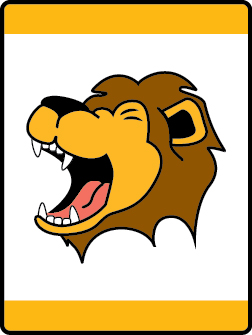

# Lion’s Roar Lion Adventure

- **Adventure name:** Lion’s Roar
- **Rank:** Lion
- **Type:** Required
- **Category:** Personal Safety

## Overview

In partnership with the Barbara Sinatra Children’s Center Foundation, Lions will learn about the “Protect Yourself Rules” and other skills needed to stay safe. Prior to any activity, use Scouting America SAFE Checklist to ensure the safety of all those involved. All participants in official Scouting America activities should become familiar with the Guide to Safe Scouting and applicable program literature or manuals.

## Requirements

### Requirement 1

With permission from your parent or legal guardian watch the Protect Yourself Rules video for the Lion rank.

**Activities:**

- **[Protect Yourself Rules Video Lion](https://www.scouting.org/cub-scout-activities/protect-yourself-rules-video-lion/)** (Indoor, energy 1, supplies 2, prep 2)
  Watch the Protect Yourself Rules video with your parent or legal guardian.

### Requirement 2

With your Lion adult partner, demonstrate Shout, Run, Tell as explained in the Protect Yourself Rules video.

**Activities:**

- **[Shout, Run, Tell Relay Lion](https://www.scouting.org/cub-scout-activities/shout-run-tell-relay-lion/)** (Indoor, energy 4, supplies 2, prep 2)
  Cub Scouts demonstrate their own personal way of shout, run, and tell.

### Requirement 3

With your Lion adult partner, demonstrate how to access emergency services.

**Activities:**

- **[Home Security Emergency Services](https://www.scouting.org/cub-scout-activities/home-security-emergency-services/)** (Indoor, energy 2, supplies 5, prep 1)
  At home learn how to contact emergency services using a home alarm or voice-activated devices.
- **[Practice 911 and Five Trusted Adults](https://www.scouting.org/cub-scout-activities/practice-911-and-five-trusted-adults/)** (Indoor, energy 2, supplies 2, prep 1)
  Practice dialing 911.

### Requirement 4

With your Lion adult partner, demonstrate how to safely cross a street or walk in a parking lot.

**Activities:**

- **[Green Means Go Red Means Stop](https://www.scouting.org/cub-scout-activities/green-means-go-red-means-stop/)** (Indoor, energy 4, supplies 2, prep 1)
  Play a game of red light, green light to reinforce how to safely cross a street.
- **[Make Believe Parking Lot](https://www.scouting.org/cub-scout-activities/make-believe-parking-lot/)** (Outdoor, energy 3, supplies 3, prep 4)
  Set up a mock crosswalk and parking lot for Cub Scouts to learn about staying safe in these situations.

## Resources

- [Lion’s Roar Lion adventure page](https://www.scouting.org/cub-scout-adventures/lions-roar/)

Note: This is an unofficial archive of Cub Scout Adventures that was automatically extracted from the Scouting America website and may contain errors.