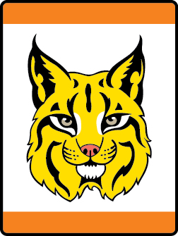

# Bobcat Tiger Tiger Adventure

- **Adventure name:** Bobcat Tiger
- **Rank:** Tiger
- **Type:** Required
- **Category:** Character & Leadership

## Overview

The Bobcat Adventure is the first required Adventure on the trail to earn the Tiger badge of rank. Once the Bobcat Adventure is completed, Tigers can start any other of the Adventures in any order. Prior to any activity, use Scouting America SAFE Checklist to ensure the safety of all those involved. All participants in official Scouting America activities should become familiar with the Guide to Safe Scouting and applicable program literature or manuals.

## Requirements

### Requirement 1

Get to know the members of your den.

**Activities:**

- **[A Time to Talk – A Time to Listen](https://www.scouting.org/cub-scout-activities/a-time-to-talk-a-time-to-listen/)** (Indoor, energy 2, supplies 1, prep 1)
  The Cub Scout sign is a way to help Cub Scouts learn good manners and communication skills.
- **[Den Doodle Tiger](https://www.scouting.org/cub-scout-activities/den-doodle-tiger/)** (Indoor, energy 3, supplies 4, prep 4)
  The den doodle is a craft project that can be used to track attendance, reward good behavior, and completion of requirements.
- **[Den Flag Tiger](https://www.scouting.org/cub-scout-activities/den-flag-tiger/)** (Indoor, energy 2, supplies 4, prep 4)
  A den flag is a craft that can bring your den together by getting to know everyone’s name and having a symbol that everyone has a part in making.
- **[Me Too Name Game](https://www.scouting.org/cub-scout-activities/me-too-name-game/)** (Indoor, energy 3, supplies 1, prep 1)
  Learn how much everyone in the den has in common.
- **[Spider Web](https://www.scouting.org/cub-scout-activities/spider-web/)** (Indoor, energy 2, supplies 2, prep 2)
  Members of the den learn about each other as they build a spider web of yarn.

### Requirement 2

Recite the Scout Oath with your den, including your Tiger adult partner.

**Activities:**

- **[Tiger Chatterbox](https://www.scouting.org/cub-scout-activities/tiger-chatterbox/)** (Indoor, energy 2, supplies 2, prep 2)
  Fold a piece of paper into a chatterbox/fortune teller to introduce the Scout Oath to your Cub Scout.
- **[Tiger Oath and Law Puzzle](https://www.scouting.org/cub-scout-activities/tiger-oath-and-law-puzzle/)** (Indoor, energy 2, supplies 2, prep 2)
  Introduce the Scout Oath to Cub Scouts by making a puzzle out of popsicle sticks.

### Requirement 3

Have your Tiger adult partner or den leader read the Scout Law to you.  Demonstrate your understanding of being trustworthy, helpful, or friendly.

**Activities:**

- **[Don’t Wake the Dragon](https://www.scouting.org/cub-scout-activities/dont-wake-the-dragon/)** (Indoor, energy 3, supplies 1, prep 1)
  In this game, Cub Scouts have to work together and demonstrate being trustworthy, helpful, and friendly.
- **[Tiger Maze](https://www.scouting.org/cub-scout-activities/tiger-maze/)** (Indoor, energy 3, supplies 2, prep 2)
  Cub Scouts help their adult partner navigate a maze.
- **[Tiger Scout Law Bingo](https://www.scouting.org/cub-scout-activities/tiger-scout-law-bingo/)** (Indoor, energy 2, supplies 2, prep 2)
  Use a bingo card to act out values of the Scout Law.

### Requirement 4

Demonstrate the Cub Scout sign, Cub Scout salute and Cub Scout handshake.  Show how each are used.

**Activities:**

- **[If You Are Happy Show the Cub Scout Sign](https://www.scouting.org/cub-scout-activities/if-you-are-happy-show-the-cub-scout-sign/)** (Indoor, energy 3, supplies 1, prep 1)
  Sing the interactive song “If you are happy and you know it” using the Cub Scout sign, handshake, and salute as the actions.
- **[Sign, Salute, and Handshake Relay](https://www.scouting.org/cub-scout-activities/sign-salute-and-handshake-relay/)** (Indoor, energy 5, supplies 1, prep 1)
  Use a relay race to get Cub Scouts moving and learning the Cub Scout sign, salute, and handshake.
- **[Tiger Simon Says](https://www.scouting.org/cub-scout-activities/tiger-simon-says/)** (Indoor, energy 4, supplies 1, prep 1)
  Play a game of Simon Says using the actions of the Cub Scout sign, salute, and handshake.

### Requirement 5

Share with your Tiger adult partner, at a den meeting or at home, a time when you have demonstrated the Cub Scout motto “Do Your Best.”

**Activities:**

- **[Do Your Best Handbook Activity](https://www.scouting.org/cub-scout-activities/do-your-best-handbook-activity/)** (Indoor, energy 1, supplies 2, prep 1)
  This activity is in the Tiger handbook where Cub Scouts will identify actions that demonstrate the Cub Scout motto “Do Your Best”
- **[Do Your Best Handbook Sharing](https://www.scouting.org/cub-scout-activities/do-your-best-handbook-sharing/)** (Indoor, energy 1, supplies 1, prep 1)
  Cub Scouts share with their adult partner a time when they did their best.

### Requirement 6

At home, with your parent or legal guardian do the activities in the booklet “ How to Protect Your Children from Child Abuse: A Parent’s Guide .”

**Activities:**

- **[Child Abuse Protection Review Tiger](https://www.scouting.org/cub-scout-activities/child-abuse-protection-review-tiger/)** (Indoor, energy 1, supplies 2, prep 1)
  Review the activities in the booklet “How to Protect Your Children from Child Abuse: A Parent’s Guide.”

## Resources

- [Bobcat Tiger Tiger adventure page](https://www.scouting.org/cub-scout-adventures/bobcat-tiger/)

Note: This is an unofficial archive of Cub Scout Adventures that was automatically extracted from the Scouting America website and may contain errors.