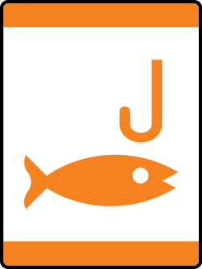

# Fish On Tiger Adventure

- **Adventure name:** Fish On
- **Rank:** Tiger
- **Type:** Elective
- **Category:** 

## Overview

With their family or den and adult partner, Tigers will learn the basics of fishing and go on a fishing adventure. Prior to any activity, use Scouting America SAFE Checklist to ensure the safety of all those involved. All participants in official Scouting America activities should become familiar with the Guide to Safe Scouting and applicable program literature or manuals.

## Requirements

### Requirement 1

With your den or Tiger adult partner, identify the body of water where you will go fishing.

**Activities:**

- **[Flashy Fish Homes](https://www.scouting.org/cub-scout-activities/flashy-fish-homes/)** (Indoor, energy 2, supplies 3, prep 2)
  Use flashcards to identify local fish.
- **[Our Fishing Spot](https://www.scouting.org/cub-scout-activities/our-fishing-spot/)** (Indoor, energy 2, supplies 3, prep 2)
  Using a local map identify the spot where you will go fishing and the fish that live in that body of water.

### Requirement 2

With your Tiger adult partner, learn the rules of fishing safely.

**Activities:**

- **[Dry Run Fishing](https://www.scouting.org/cub-scout-activities/dry-run-fishing/)** (Outdoor, energy 3, supplies 4, prep 2)
  Using fishing poles, practice the fishing rules before going on the fishing adventure.
- **[Fishing Safety Match](https://www.scouting.org/cub-scout-activities/fishing-safety-match/)** (Indoor, energy 2, supplies 2, prep 1)
  Learn the fishing safety rules by completing the activity in the Tiger handbook.

### Requirement 3

Draw a picture of the type of fish you think lives in the water where you are going fishing.

**Activities:**

- **[Scales and Sketches](https://www.scouting.org/cub-scout-activities/scales-and-sketches/)** (Indoor, energy 2, supplies 2, prep 2)
  Using the Tiger handbook draw two fish that live in the water you are going fishing.

### Requirement 4

Go fishing with your Tiger adult partner.

**Activities:**

- **[Fish On!](https://www.scouting.org/cub-scout-activities/fish-on/)** (Outdoor, energy 4, supplies 4, prep 5)
  Go fishing with your den.

## Resources

- [Fish On Tiger adventure page](https://www.scouting.org/cub-scout-adventures/fish-on/)

Note: This is an unofficial archive of Cub Scout Adventures that was automatically extracted from the Scouting America website and may contain errors.