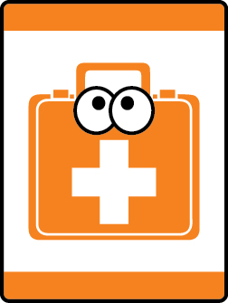

# Safe and Smart Tiger Adventure

- **Adventure name:** Safe and Smart
- **Rank:** Tiger
- **Type:** Elective
- **Category:** 

## Overview

Tigers will learn about fire safety and other ways to prepare and respond to emergencies. Prior to any activity, use Scouting America SAFE Checklist to ensure the safety of all those involved. All participants in official Scouting America activities should become familiar with the Guide to Safe Scouting and applicable program literature or manuals.

## Requirements

### Requirement 1

Memorize your address. Recite it to your Tiger adult partner or den leader.

**Activities:**

- **[BINGO! That is Where I Live](https://www.scouting.org/cub-scout-activities/bingo-that-is-where-i-live/)** (Indoor, energy 2, supplies 2, prep 1)
  Cub Scouts learn their address by putting it to the tune of BINGO.
- **[In Case of an Emergency](https://www.scouting.org/cub-scout-activities/in-case-of-an-emergency/)** (Indoor, energy 2, supplies 2, prep 1)
  Tigers will complete an activity with their, name, address, emergency contact number, and 911 to post in their home.

### Requirement 2

Memorize an emergency contact’s phone number. Recite it to your Tiger adult partner or den leader.

**Activities:**

- **[Cheerio My Number](https://www.scouting.org/cub-scout-activities/cheerio-my-number/)** (Indoor, energy 2, supplies 2, prep 1)
  Using Cheerios, Cub Scouts learn their emergency contact number.
- **[Sing a Phone Song](https://www.scouting.org/cub-scout-activities/sing-a-phone-song/)** (Indoor, energy 2, supplies 2, prep 1)
  Cub Scouts learn to memorize their phone number through a song.

### Requirement 3

Show you can Stop, Drop and Roll.

**Activities:**

- **[Stop Drop and Roll Relay](https://www.scouting.org/cub-scout-activities/stop-drop-and-roll-relay/)** (Indoor, energy 5, supplies 1, prep 1)
  Cub Scouts learn how to Stop Drop and Roll by playing a relay race.

### Requirement 4

With your Tiger adult partner or den leader, create a fire escape plan for your home or den meeting  place.  Include your outside meet-up spot.  Practice the escape route you would take.

**Activities:**

- **[Den Meeting Exit Plan](https://www.scouting.org/cub-scout-activities/den-meeting-exit-plan/)** (Indoor, energy 3, supplies 2, prep 2)
  The den will work to develop an evacuation plan for their meeting location and identify a meet-up spot.
- **[It’s Time to Get Out!](https://www.scouting.org/cub-scout-activities/its-time-to-get-out/)** (Indoor, energy 4, supplies 2, prep 2)
  Create an escape route.

### Requirement 5

With your Tiger adult partner, find the location of the smoke detectors in your home or den meeting place.  Confirm they are working properly.

**Activities:**

- **[Where There Is Smoke](https://www.scouting.org/cub-scout-activities/where-there-is-smoke/)** (Indoor, energy 1, supplies 1, prep 1)
  Locate smoke detectors in your home.

### Requirement 6

With your Tiger adult partner or den leader, learn why matches and lighters are only for adults.

**Activities:**

- **[Spread Like Wildfire](https://www.scouting.org/cub-scout-activities/spread-like-wildfire/)** (Outdoor, energy 4, supplies 1, prep 1)
  The den will learn how fast fire can spread and why starting fires can cause harm.

### Requirement 7

Visit an emergency responder station or have an emergency responder visit your den.

**Activities:**

- **[Meet Emergency Responders](https://www.scouting.org/cub-scout-activities/meet-emergency-responders/)** (Travel, energy 3, supplies 1, prep 5)
  Plan a visit to a fire station or other emergency response station.

## Resources

- [Safe and Smart Tiger adventure page](https://www.scouting.org/cub-scout-adventures/safe-and-smart/)

Note: This is an unofficial archive of Cub Scout Adventures that was automatically extracted from the Scouting America website and may contain errors.