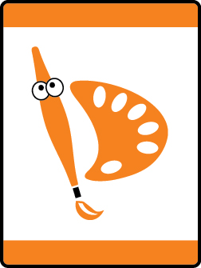

# Stories in Shapes Tiger Adventure

- **Adventure name:** Stories in Shapes
- **Rank:** Tiger
- **Type:** Elective
- **Category:** 

## Overview

Tigers will explore math through the discovery of art and how shapes and symbols can tell a story. Prior to any activity, use Scouting America SAFE Checklist to ensure the safety of all those involved. All participants in official Scouting America activities should become familiar with the Guide to Safe Scouting and applicable program literature or manuals.

## Requirements

### Requirement 1

Explore art in your community.

**Activities:**

- **[Art on Display](https://www.scouting.org/cub-scout-activities/art-on-display/)** (Travel, energy 3, supplies 1, prep 5)
  Visit an art museum.
- **[Art Trail](https://www.scouting.org/cub-scout-activities/art-trail/)** (Travel, energy 4, supplies 2, prep 5)
  Take a walk in a neighborhood with public art such as outdoor murals, statues, and sculptures.
- **[Virtual Tour of Art](https://www.scouting.org/cub-scout-activities/virtual-tour-of-art/)** (Indoor, energy 1, supplies 3, prep 5)
  Coordinate a virtual tour of the Van Gogh Museum in Amsterdam, Netherlands.

### Requirement 2

Look closely at art or a picture of art with your den or Tiger adult partner. Decide what you like about the art, and share your ideas with your den, family or Tiger adult partner.

**Activities:**

- **[Art on Display part 2](https://www.scouting.org/cub-scout-activities/art-on-display-part-2/)** (Travel, energy 1, supplies 1, prep 5)
  This activity is designed to be done in combination with requirement 1 and the Art on Display activity at an art museum.
- **[Art Trail part 2](https://www.scouting.org/cub-scout-activities/art-trail-part-2/)** (Travel, energy 1, supplies 1, prep 5)
  This activity is designed to be done in combination with requirement 1 and the Art Trail activity.
- **[Virtual Tour of Art 2](https://www.scouting.org/cub-scout-activities/virtual-tour-of-art-2/)** (Indoor, energy 1, supplies 1, prep 5)
  This activity is designed to be done in combination with requirement 1 and the Virtual Tour of Art activity.

### Requirement 3

Create a piece of art using shapes.

**Activities:**

- **[Folding Art](https://www.scouting.org/cub-scout-activities/folding-art/)** (Indoor, energy 2, supplies 2, prep 2)
  Make an origami cat.
- **[My Art From Shapes](https://www.scouting.org/cub-scout-activities/my-art-from-shapes/)** (Indoor, energy 2, supplies 2, prep 2)
  Using the shapes in the Tiger Handbook (page 55) make a piece of art.
- **[Spiral Art](https://www.scouting.org/cub-scout-activities/spiral-art/)** (Indoor, energy 2, supplies 3, prep 2)
  Make a drawing using a spiral stencil set.
- **[Tangram Animals](https://www.scouting.org/cub-scout-activities/tangram-animals/)** (Indoor, energy 2, supplies 2, prep 2)
  Using tangrams make animal shapes.

### Requirement 4

Learn how to spell your name in Braille and sign language.

**Activities:**

- **[Get To Know Me and Sign Language](https://www.scouting.org/cub-scout-activities/get-to-know-me-and-sign-language/)** (Indoor, energy 2, supplies 2, prep 5)
  Invite someone who is deaf or an interpreter for the deaf to visit the den.
- **[Reading with Your Hands](https://www.scouting.org/cub-scout-activities/reading-with-your-hands/)** (Indoor, energy 2, supplies 2, prep 2)
  Using puffy round stickers spell your name in braille.
- **[The Art of Sign Language](https://www.scouting.org/cub-scout-activities/the-art-of-sign-language/)** (Indoor, energy 2, supplies 2, prep 1)
  Cub Scouts will learn about American Sign Language and how to sign their name.

## Resources

- [Stories in Shapes Tiger adventure page](https://www.scouting.org/cub-scout-adventures/stories-in-shapes/)

Note: This is an unofficial archive of Cub Scout Adventures that was automatically extracted from the Scouting America website and may contain errors.