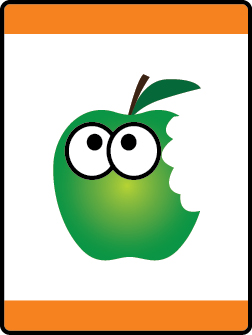

# Tiger Bites Tiger Adventure

- **Adventure name:** Tiger Bites
- **Rank:** Tiger
- **Type:** Required
- **Category:** Personal Fitness

## Overview

In this Adventure, Tigers will explore the different food groups, have fun being active, and the importance of rest. Prior to any activity, use Scouting America SAFE Checklist to ensure the safety of all those involved. All participants in official Scouting America activities should become familiar with the Guide to Safe Scouting and applicable program literature or manuals.

## Requirements

### Requirement 1

Identify the 5 different food groups.

**Activities:**

- **[Food Group Tiger Relay](https://www.scouting.org/cub-scout-activities/food-group-tiger-relay/)** (Indoor, energy 4, supplies 4, prep 2)
  Relay race to  identify  food items and the food group they belong to.
- **[My Favorite Foods](https://www.scouting.org/cub-scout-activities/my-favorite-foods/)** (Indoor, energy 2, supplies 2, prep 2)
  Cub Scouts draw their favorite food for each of the five good groups.
- **[My Favorite Snack](https://www.scouting.org/cub-scout-activities/my-favorite-snack/)** (Indoor, energy 2, supplies 4, prep 3)
  Cub Scouts bring and share their favorite food from one of the five food groups.

### Requirement 2

Practice hand washing. Point out when you should wash your hands.

**Activities:**

- **[Scout Oath and Law Hand Washing](https://www.scouting.org/cub-scout-activities/scout-oath-and-law-hand-washing/)** (Indoor, energy 2, supplies 2, prep 1)
  Proper handwashing and learning how long it takes to do a good  job.

### Requirement 3

Be active for 30 minutes.

**Activities:**

- **[Tiger Obstacle Course](https://www.scouting.org/cub-scout-activities/tiger-obstacle-course/)** (Outdoor, energy 5, supplies 5, prep 4)
  Obstacle Course.
- **[Tiger Red Light Green Light](https://www.scouting.org/cub-scout-activities/tiger-red-light-green-light/)** (Indoor, energy 5, supplies 1, prep 1)
  Play Red Light / Green Light.
- **[Tiger Soccer](https://www.scouting.org/cub-scout-activities/tiger-soccer/)** (Outdoor, energy 5, supplies 2, prep 2)
  Play Soccer with the Den.

### Requirement 4

Practice methods that help you sleep.

**Activities:**

- **[Tiger Get Ready for Bed](https://www.scouting.org/cub-scout-activities/tiger-get-ready-for-bed/)** (Indoor, energy 2, supplies 2, prep 2)
  Make a bedtime routine to help get enough sleep using the activity in the Tiger  handbook .
- **[Tiger Time to Sleep](https://www.scouting.org/cub-scout-activities/tiger-time-to-sleep/)** (Indoor, energy 1, supplies 1, prep 1)
  Cub Scouts with their parent or legal guardian  establish  a good  bedtime.

## Resources

- [Tiger Bites Tiger adventure page](https://www.scouting.org/cub-scout-adventures/tiger-bites/)

Note: This is an unofficial archive of Cub Scout Adventures that was automatically extracted from the Scouting America website and may contain errors.