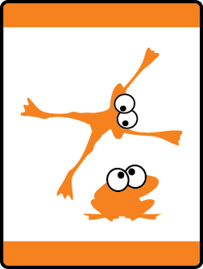

# Tiger Tag Tiger Adventure

- **Adventure name:** Tiger Tag
- **Rank:** Tiger
- **Type:** Elective
- **Category:** 

## Overview

Learning teamwork, good sportsmanship, and having fun with their family or den by playing outdoor games or sports in packed into this Adventure including attending a sporting event together. Prior to any activity, use Scouting America SAFE Checklist to ensure the safety of all those involved. All participants in official Scouting America activities should become familiar with the Guide to Safe Scouting and applicable program literature or manuals.

## Requirements

### Requirement 1

Play an active game with your den. Share with your Tiger adult partner or your den why you like this game.

**Activities:**

- **[Tiger Blob Tag](https://www.scouting.org/cub-scout-activities/tiger-blob-tag/)** (Outdoor, energy 4, supplies 2, prep 1)
  Play Blob Tag.
- **[Tiger Duck Duck Goose](https://www.scouting.org/cub-scout-activities/tiger-duck-duck-goose/)** (Indoor, energy 4, supplies 1, prep 1)
  Play a game of duck, duck, goose.
- **[Tiger Hide and Seek](https://www.scouting.org/cub-scout-activities/tiger-hide-and-seek/)** (Outdoor, energy 4, supplies 1, prep 1)
  Play a game of hide and  seek .

### Requirement 2

Play a relay game with your den.  Share with your Tiger adult partner or your den why you like this game.

**Activities:**

- **[Tiger Dress Up Relay](https://www.scouting.org/cub-scout-activities/tiger-dress-up-relay/)** (Indoor, energy 4, supplies 2, prep 2)
  Play Tiger Dress-Up relay.
- **[Tiger Passing the Ball Relay](https://www.scouting.org/cub-scout-activities/tiger-passing-the-ball-relay/)** (Indoor, energy 4, supplies 2, prep 2)
  Play Passing the Ball Relay race.
- **[Tiger Ping-pong Relay](https://www.scouting.org/cub-scout-activities/tiger-ping-pong-relay/)** (Indoor, energy 4, supplies 2, prep 2)
  Play Ping-pong ball relay.

### Requirement 3

Discuss what it means to be a good sport in a game with your Tiger adult partner or other Tigers.

**Activities:**

- **[Referee Visit](https://www.scouting.org/cub-scout-activities/referee-visit/)** (Indoor, energy 1, supplies 1, prep 5)
  Invite someone who is a referee (volunteer or professional) to discuss sportsmanship with the den.
- **[Who is Being a Good Sport](https://www.scouting.org/cub-scout-activities/who-is-being-a-good-sport/)** (Indoor, energy 2, supplies 2, prep 1)
  Cub Scouts complete activity in the Tiger handbook to  identify  good sportsmanship.

## Resources

- [Tiger Tag Tiger adventure page](https://www.scouting.org/cub-scout-adventures/tiger-tag/)

Note: This is an unofficial archive of Cub Scout Adventures that was automatically extracted from the Scouting America website and may contain errors.