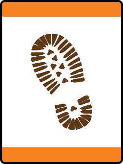

# Tigers in the Wild Tiger Adventure

- **Adventure name:** Tigers in the Wild
- **Rank:** Tiger
- **Type:** Required
- **Category:** Outdoors

## Overview

Tigers and adult partners will take a walk to explore the outdoors . Along the way, they can learn about domesticated and wild animals. Prior to any activity, use Scouting America SAFE Checklist to ensure the safety of all those involved. All participants in official Scouting America activities should become familiar with the Guide to Safe Scouting and applicable program literature or manuals.

## Requirements

### Requirement 1

Identify the Cub Scout Six Essentials.  Show what you do with each item.

**Activities:**

- **[Grab the Six Essentials](https://www.scouting.org/cub-scout-activities/grab-the-six-essentials/)** (Indoor, energy 5, supplies 5, prep 3)
  Relay race for Cub Scouts to identify the Cub Scout Six Essentials.
- **[Is It a Cub Scout Essential?](https://www.scouting.org/cub-scout-activities/is-it-a-cub-scout-essential/)** (Indoor, energy 2, supplies 5, prep 3)
  Cub Scouts pick out the Cub Scout six essentials from mix of outdoor equipment.
- **[Outdoor Code in a Flash](https://www.scouting.org/cub-scout-activities/outdoor-code-in-a-flash/)** (Indoor, energy 2, supplies 2, prep 2)
  Flash card activity to introduce Cub Scouts to the Outdoor Code.

### Requirement 2

With your den leader or Tiger adult partner, learn about the Outdoor Code.

**Activities:**

- **[Outdoor Code Puzzle](https://www.scouting.org/cub-scout-activities/outdoor-code-puzzle/)** (Indoor, energy 2, supplies 2, prep 1)
  Cub Scouts use their Tiger handbook to create an Outdoor Code puzzle.
- **[The Four C’s of the Outdoor Code](https://www.scouting.org/cub-scout-activities/the-four-cs-of-the-outdoor-code/)** (Indoor, energy 1, supplies 1, prep 1)
  The four C’s is a method of introducing the Outdoor Code.

### Requirement 3

With your den, pack, or family, take a walk outside spending for at least 20 minutes exploring the outdoors with your Cub Scout Six Essentials.  While outside, identify things that you see with your Tiger adult partner that are natural and things that are manmade.

**Activities:**

- **[5 Step Seek](https://www.scouting.org/cub-scout-activities/5-step-seek/)** (Outdoor, energy 4, supplies 3, prep 3)
  Adult partners give a clue to something they see outside as Cub Scouts guess what it is and if it is natural or manmade.
- **[I Spy Natural or Manmade](https://www.scouting.org/cub-scout-activities/i-spy-natural-or-manmade/)** (Outdoor, energy 4, supplies 3, prep 3)
  A game of I Spy that includes objects that are natural or manmade.
- **[Natural or Manmade by the Numbers](https://www.scouting.org/cub-scout-activities/natural-or-manmade-by-the-numbers/)** (Outdoor, energy 4, supplies 3, prep 3)
  Cub Scouts and adult partners work together to identify as many things they can that are natural and manmade.

### Requirement 4

Identify common animals that are found where you live. Learn which of those animals is domesticated and which animal is wild.  Draw a picture of your favorite animal.

**Activities:**

- **[My Favorite Animals](https://www.scouting.org/cub-scout-activities/my-favorite-animals/)** (Indoor, energy 2, supplies 1, prep 1)
  Cub Scouts draw their favorite domesticated and wild animal.
- **[Stuffed Animal Relay Race](https://www.scouting.org/cub-scout-activities/stuffed-animal-relay-race/)** (Indoor, energy 4, supplies 3, prep 3)
  Using stuffed animals Cub Scouts identify if the animal is wild or domesticated.

### Requirement 5

Look for a tree where you live.  Describe how this tree is helpful.

**Activities:**

- **[Leaf and Bark Rubbing](https://www.scouting.org/cub-scout-activities/leaf-and-bark-rubbing/)** (Outdoor, energy 3, supplies 2, prep 2)
  Make a leaf and bark rubbing of a tree.
- **[Pinecone Bird Feeder](https://www.scouting.org/cub-scout-activities/pinecone-bird-feeder/)** (Outdoor, energy 3, supplies 4, prep 3)
  Make a pinecone bird feeder and place it in a tree.
- **[Tiger Tree Planting](https://www.scouting.org/cub-scout-activities/tiger-tree-planting/)** (Outdoor, energy 4, supplies 4, prep 5)
  Plant a tree.

## Resources

- [Tigers in the Wild Tiger adventure page](https://www.scouting.org/cub-scout-adventures/tigers-in-the-wild/)

Note: This is an unofficial archive of Cub Scout Adventures that was automatically extracted from the Scouting America website and may contain errors.