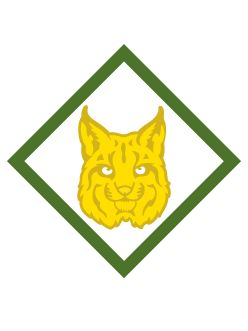

# Bobcat Webelos Webelos Adventure

- **Adventure name:** Bobcat Webelos
- **Rank:** Webelos
- **Type:** Required
- **Category:** Character & Leadership

## Overview

The Bobcat Adventure is the first required Adventure on the trail to earn the Webelos badge of rank.  Once the Bobcat Adventure is completed, Webelos can start any other of the Adventures in any order. Prior to any activity, use Scouting America’s SAFE Checklist to ensure the safety of all those involved. All participants in official Scouting America activities should become familiar with the Guide to Safe Scouting and applicable program literature or manuals.

## Requirements

### Requirement 1

Get to know members of your den.

**Activities:**

- **[Den Doodle Webelos](https://www.scouting.org/cub-scout-activities/den-doodle-webelos/)** (Indoor, energy 2, supplies 3, prep 2)
  Cub Scouts make a den doodle to help get to know their den members.
- **[Den Flag Webelos](https://www.scouting.org/cub-scout-activities/den-flag-webelos/)** (Indoor, energy 2, supplies 4, prep 3)
  Cub Scouts make a den flag that shows something about each member.
- **[Hula Hoop Pass](https://www.scouting.org/cub-scout-activities/hula-hoop-pass/)** (Indoor, energy 5, supplies 2, prep 1)
  Cub Scouts play the Hula Hoop Pass game to learn about teamwork.
- **[Silent Line Up](https://www.scouting.org/cub-scout-activities/silent-line-up/)** (Indoor, energy 4, supplies 1, prep 1)
  In this activity, Cub Scouts will learn some facts about each other without saying a word.

### Requirement 2

Recite the Scout Oath and the Scout Law with your den and den leader.  Describe the three points of the Scout Oath.

**Activities:**

- **[Recite the Oath and Law Webelos](https://www.scouting.org/cub-scout-activities/recite-the-oath-and-law-webelos/)** (Indoor, energy 1, supplies 1, prep 1)
  In this activity, Cub Scouts recite the Scout Oath and Scout Law and learn about the three points of the Scout Oath.

### Requirement 3

Learn about the Scout Law.

**Activities:**

- **[Scout Law Detective](https://www.scouting.org/cub-scout-activities/scout-law-detective/)** (Indoor, energy 3, supplies 2, prep 2)
  The points of the Scout Law are reinforced to Cub Scouts while they try to determine which point is missing.
- **[Scout Law Impersonation Game](https://www.scouting.org/cub-scout-activities/scout-law-impersonation-game/)** (Indoor, energy 4, supplies 2, prep 2)
  Cub Scouts impersonate points of the Scout Law then try to guess who was impersonating each point.
- **[Scout Law Relay](https://www.scouting.org/cub-scout-activities/scout-law-relay/)** (Indoor, energy 5, supplies 2, prep 1)
  Cub Scouts learn about the Scout Law in this fun relay race.

### Requirement 4

With your den create a den Code of Conduct.

**Activities:**

- **[Code of Conduct Webelos](https://www.scouting.org/cub-scout-activities/code-of-conduct-webelos/)** (Indoor, energy 1, supplies 2, prep 2)
  Cub Scouts will be invested in their own conduct when they help create their den Code of Conduct.

### Requirement 5

Learn about the denner position and responsibilities.

**Activities:**

- **[Lead Opening and Closing Ceremonies](https://www.scouting.org/cub-scout-activities/lead-opening-and-closing-ceremonies/)** (Indoor, energy 2, supplies 2, prep 2)
  Cub Scouts learn how to lead opening and closing ceremonies.
- **[What Does a Denner Do?](https://www.scouting.org/cub-scout-activities/what-does-a-denner-do/)** (Indoor, energy 2, supplies 2, prep 2)
  Cub Scouts learn about the denner’s responsibilities by making a list.
- **[Who’s the Denner?](https://www.scouting.org/cub-scout-activities/whos-the-denner/)** (Indoor, energy 2, supplies 2, prep 1)
  Cub Scouts prepare a calendar of the dates that each person will serve as the denner.

### Requirement 6

Demonstrate the Cub Scout sign, Cub Scout salute and Cub Scout handshake.  Show how each is used.

**Activities:**

- **[Roll a Cub Scout Fundamental](https://www.scouting.org/cub-scout-activities/roll-a-cub-scout-fundamental/)** (Indoor, energy 3, supplies 2, prep 2)
  Cub Scouts demonstrate the Cub Scout sign, salute, and handshake.
- **[Teach the Cub Scout Sign, Salute, and Handshake](https://www.scouting.org/cub-scout-activities/teach-the-cub-scout-sign-salute-and-handshake/)** (Indoor, energy 4, supplies 2, prep 2)
  Cub Scouts help younger Cub Scouts learn the Cub Scout sign, salute, and handshake.
- **[Using Cub Scout Fundamentals](https://www.scouting.org/cub-scout-activities/using-cub-scout-fundamentals/)** (Indoor, energy 3, supplies 2, prep 2)
  Cub Scouts use the Cub Scout sign, salute, and handshake while leading an opening and closing ceremony.

### Requirement 7

At home, with your parent or legal guardian do the activities in the booklet “How to Protect Your Children from Child Abuse: A Parent’s Guide.”

**Activities:**

- **[Child Abuse Protection Review Webelos](https://www.scouting.org/cub-scout-activities/child-abuse-protection-review-webelos/)** (Indoor, energy 1, supplies 2, prep 1)
  Review the activities in the booklet “How to Protect Your Children from Child Abuse: A Parent’s Guide.”

## Resources

- [Bobcat Webelos Webelos adventure page](https://www.scouting.org/cub-scout-adventures/bobcat-webelos/)

Note: This is an unofficial archive of Cub Scout Adventures that was automatically extracted from the Scouting America website and may contain errors.