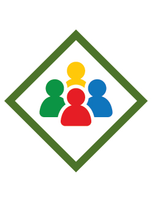

# My Community Webelos Adventure

- **Adventure name:** My Community
- **Rank:** Webelos
- **Type:** Required
- **Category:** Citizenship

## Overview

This Adventure is all about being a good citizen. You’ll learn about the different types of voting and how our national government maintains the balance of power. You’ll meet with a local politician and discuss how they were elected and their role in government. Prior to any activity, use Scouting America’s SAFE Checklist to ensure the safety of all those involved. All participants in official Scouting America activities should become familiar with the Guide to Safe Scouting and applicable program literature or manuals.

## Requirements

### Requirement 1

Learn about majority and plurality types of voting.

**Activities:**

- **[Denner Election](https://www.scouting.org/cub-scout-activities/denner-election/)** (Indoor, energy 2, supplies 2, prep 2)
  Demonstrate plurality voting  and majority  voting to  determine  your next  denner .
- **[Snack-lections](https://www.scouting.org/cub-scout-activities/snack-lections/)** (Indoor, energy 2, supplies 2, prep 2)
  Using a variety of voting, select the snack for your next den meeting.

### Requirement 2

Speak with someone who is elected to their position.  Discover the type of voting that was used for to elect them and why.

**Activities:**

- **[Our Elected Official](https://www.scouting.org/cub-scout-activities/our-elected-official/)** (Indoor, energy 2, supplies 1, prep 4)
  Invite a community-elected official to learn about the type of voting used in their election.

### Requirement 3

Choose a federal law and create a timeline of the history of the law.  Include the involvement of the 3 branches of government.

**Activities:**

- **[History of the Americans with Disabilities Act](https://www.scouting.org/cub-scout-activities/history-of-the-americans-with-disabilities-act/)** (Indoor, energy 2, supplies 2, prep 3)
  Cub Scouts learn about the history of the Americans with Disabilities Act.

### Requirement 4

Participate in a service project.

**Activities:**

- **[Diaper and Formula Drive](https://www.scouting.org/cub-scout-activities/diaper-and-formula-drive/)** (Indoor, energy 3, supplies 3, prep 5)
  With your den, host a diaper and formula drive to donate to an organization that gives them to those in need.
- **[Happy Birthday Bag Project](https://www.scouting.org/cub-scout-activities/happy-birthday-bag-project/)** (Indoor, energy 3, supplies 3, prep 5)
  Cub Scouts help those less fortunate have a happy birthday by making birthday bags for a local food pantry.
- **[Webelos Scouting for Food](https://www.scouting.org/cub-scout-activities/webelos-scouting-for-food/)** (Travel, energy 3, supplies 1, prep 5)
  Participate in your Council-sponsored Scouting for Food event.

## Resources

- [My Community Webelos adventure page](https://www.scouting.org/cub-scout-adventures/my-community/)

Note: This is an unofficial archive of Cub Scout Adventures that was automatically extracted from the Scouting America website and may contain errors.