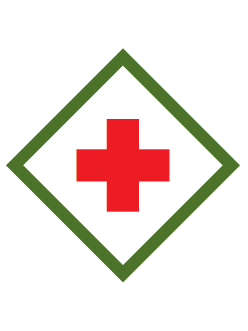

# My Safety Webelos Adventure

- **Adventure name:** My Safety
- **Rank:** Webelos
- **Type:** Required
- **Category:** Personal Safety

## Overview

In this Adventure, you will strengthen your ability to keep yourself safe with the “Protect Yourself Rules” and learn ways to keep your home and meeting space safe. Prior to any activity, use Scouting America SAFE Checklist to ensure the safety of all those involved. All participants in official Scouting America activities should become familiar with the Guide to Safe Scouting and applicable program literature or manuals.

## Requirements

### Requirement 1

With permission from your parent or legal guardian, watch the Protect Yourself Rules video for the Webelos rank.

**Activities:**

- **[Protect Yourself Video Webelos](https://www.scouting.org/cub-scout-activities/protect-yourself-video-webelos/)** (Indoor, energy 1, supplies 2, prep 2)
  Watch the Protect Yourself Rules video with your parent or legal guardian.

### Requirement 2

Identify items in your house that are hazardous and make sure they are stored properly.  Identify on the package where it describes what to do if someone is accidentally exposed to them.

**Activities:**

- **[Hazard Labels](https://www.scouting.org/cub-scout-activities/hazard-labels/)** (Indoor, energy 3, supplies 2, prep 2)
  Walk around your home and  identify  items that are hazardous. Post the Poison Control information in  a central place  to have available should it be needed.
- **[Safe Hazardous Material Storage](https://www.scouting.org/cub-scout-activities/safe-hazardous-material-storage/)** (Indoor, energy 2, supplies 2, prep 2)
  Create a safe place in your meeting space to store hazardous items.

### Requirement 3

Identify ways you and your family keep your home or your meeting space safe.

**Activities:**

- **[Safe Den Meeting Checklist](https://www.scouting.org/cub-scout-activities/safe-den-meeting-checklist/)** (Indoor, energy 3, supplies 2, prep 2)
  Using the safety checklist,  identify  ways to keep your meeting space safe.
- **[Safe Home Safety Checklist](https://www.scouting.org/cub-scout-activities/safe-home-safety-checklist/)** (Indoor, energy 3, supplies 2, prep 2)
  Using the safety checklist,  identify  ways to  keeping  their home safe.

### Requirement 4

Complete the Be Prepared for Natural Events worksheet. Complete a worksheet for at least two natural events most likely to happen near where you live.

**Activities:**

- **[Be Prepared for Natural Events](https://www.scouting.org/cub-scout-activities/be-prepared-for-natural-events/)** (Indoor, energy 3, supplies 2, prep 2)
  Complete the “Be Prepared for Natural Events” worksheet.

## Resources

- [My Safety Webelos adventure page](https://www.scouting.org/cub-scout-adventures/my-safety/)

Note: This is an unofficial archive of Cub Scout Adventures that was automatically extracted from the Scouting America website and may contain errors.