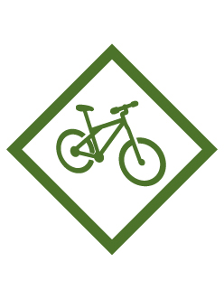

# Pedal Away Webelos Adventure

- **Adventure name:** Pedal Away
- **Rank:** Webelos
- **Type:** Elective
- **Category:** 

## Overview

Get your helmet and your Cub Scout Six Essentials–we are going on a bike ride. Learn how the gears on a bike work and make it easier for you to pedal. Practice safety and good maintenance of your bike, and it will last a long time. Prior to any activity, use Scouting America SAFE Checklist to ensure the safety of all those involved. All participants in official Scouting America activities should become familiar with the Guide to Safe Scouting and applicable program literature or manuals.

## Requirements

### Requirement 1

Decide on gear and supplies you should bring for a long bike ride.

**Activities:**

- **[All We Need](https://www.scouting.org/cub-scout-activities/all-we-need/)** (Indoor, energy 2, supplies 2, prep 2)
  Cub Scouts learn the additional gear needed for a longer bike ride.
- **[I Went on a Bike Ride and Took](https://www.scouting.org/cub-scout-activities/i-went-on-a-bike-ride-and-took/)** (Indoor, energy 2, supplies 3, prep 3)
  Cub Scouts determine the gear needed for a longer bike ride through a game.

### Requirement 2

Discover how multi-gear bicycles work and how they benefit a rider .

**Activities:**

- **[Webelos Gear Guidance](https://www.scouting.org/cub-scout-activities/webelos-gear-guidance/)** (Outdoor, energy 2, supplies 5, prep 2)
  Cub Scouts learn about multi-gear bikes.

### Requirement 3

Practice how to lubricate a chain.

**Activities:**

- **[Webelos Chain Maintenance](https://www.scouting.org/cub-scout-activities/webelos-chain-maintenance/)** (Outdoor, energy 2, supplies 5, prep 5)
  Cub Scouts learn how to maintain their bike chain.

### Requirement 4

Pick a bicycle lock that you will use. Demonstrate how it locks and unlocks, how it secures your bicycle, and how you carry it while you are riding your bicycle.

**Activities:**

- **[Webelos Lock It Up](https://www.scouting.org/cub-scout-activities/webelos-lock-it-up/)** (Outdoor, energy 3, supplies 5, prep 5)
  Cub Scouts learn about different types of bike locks and how to open them.

### Requirement 5

With your family, den, or pack, use a map and plan a bicycle ride that is at least 5 miles.

**Activities:**

- **[Webelos Map The Ride](https://www.scouting.org/cub-scout-activities/webelos-map-the-ride/)** (Indoor, energy 2, supplies 2, prep 3)
  Cub Scouts plan and choose route for the 5-mile bike ride.

### Requirement 6

With your den, pack, or family and using the buddy system, go on a bicycle ride that is a minimum of 5 miles.

**Activities:**

- **[Webelos Bike Ride](https://www.scouting.org/cub-scout-activities/webelos-bike-ride/)** (Travel, energy 5, supplies 5, prep 5)
  Cub Scouts and adults go on a 5-mile bike ride.

## Resources

- [Pedal Away Webelos adventure page](https://www.scouting.org/cub-scout-adventures/pedal-away/)

Note: This is an unofficial archive of Cub Scout Adventures that was automatically extracted from the Scouting America website and may contain errors.