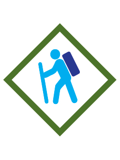

# Webelos Walkabout Webelos Adventure

- **Adventure name:** Webelos Walkabout
- **Rank:** Webelos
- **Type:** Required
- **Category:** Outdoors

## Overview

Some places you can only get to if you walk. Walking is great exercise and a fun activity to do with your den or family. In the Webelos Walkabout Adventure, you’ll learn how to prepare for a 2-mile walk, what you should bring along, and what you should do if there is an emergency.  And when you are ready, take your walk! Prior to any activity, use Scouting America SAFE Checklist to ensure the safety of all those involved. All participants in official Scouting America activities should become familiar with the Guide to Safe Scouting and applicable program literature or manuals.

## Requirements

### Requirement 1

Prepare for a 2-mile walk outside. Gather your Cub Scout Six Essentials and weather appropriate clothing and shoes.

**Activities:**

- **[Cub Scout Essential Six Review](https://www.scouting.org/cub-scout-activities/cub-scout-essential-six-review/)** (Indoor, energy 2, supplies 3, prep 2)
  Cub Scouts will review Cub Scout Six Essentials and appropriate clothing.

### Requirement 2

Plan a 2-mile route for your walk.

**Activities:**

- **[Digital Map](https://www.scouting.org/cub-scout-activities/digital-map/)** (Indoor, energy 2, supplies 2, prep 2)
  Cub Scouts plan a route for a two-mile walk.
- **[Plan A Route](https://www.scouting.org/cub-scout-activities/plan-a-route/)** (Indoor, energy 2, supplies 2, prep 2)
  Cub Scouts will plan a route for the 2-mile walk.

### Requirement 3

Check the weather forecast for the time of your planned 2-mile walk.

**Activities:**

- **[What’s The Forecast?](https://www.scouting.org/cub-scout-activities/whats-the-forecast/)** (Indoor, energy 2, supplies 2, prep 2)
  Cub Scouts check the weather forecast for the 2-mile walk.

### Requirement 4

Review the four points of Scouting America SAFE Checklist and how you will apply them on your 2-mile walk.

**Activities:**

- **[Safety First](https://www.scouting.org/cub-scout-activities/safety-first/)** (Indoor, energy 2, supplies 2, prep 2)
  Cub Scouts review the four points of Scouting America SAFE checklist.

### Requirement 5

Demonstrate first aid for each of the following events that could occur on your 2-mile walk: blister, sprained ankle, sunburn, dehydration and heat related illness.

**Activities:**

- **[First Aid Demonstration](https://www.scouting.org/cub-scout-activities/first-aid-demonstration/)** (Indoor, energy 3, supplies 4, prep 5)
  Cub Scouts invite members from a Scouts Scouting America troop, Venturing crew, or Sea Scouts ship to a den meeting and allow them to demonstrate first aid.
- **[First Responder Visit](https://www.scouting.org/cub-scout-activities/first-responder-visit/)** (Travel, energy 3, supplies 4, prep 5)
  Cub Scouts visit a first responder to learn about first aid.
- **[Trail First Aid](https://www.scouting.org/cub-scout-activities/trail-first-aid/)** (Indoor, energy 4, supplies 4, prep 3)
  Cub Scouts learn first aid for blisters, sprained ankles, sunburns, and dehydration.

### Requirement 6

With your den, pack, or family, go on your 2-mile walk while practicing the Leave No Trace Principles for Kids and Outdoor Code.

**Activities:**

- **[The Two-Mile Walk](https://www.scouting.org/cub-scout-activities/the-two-mile-walk/)** (Travel, energy 5, supplies 3, prep 3)
  Cub Scouts go on a two-mile walk.

### Requirement 7

After your 2-mile walk, discuss with your den what went well and what you would do differently next time.

**Activities:**

- **[Stop-Start-Continue](https://www.scouting.org/cub-scout-activities/stop-start-continue/)** (Outdoor, energy 1, supplies 1, prep 1)
  Cub Scouts assess their two-mile walk.

## Resources

- [Webelos Walkabout Webelos adventure page](https://www.scouting.org/cub-scout-adventures/webelos-walkabout/)

Note: This is an unofficial archive of Cub Scout Adventures that was automatically extracted from the Scouting America website and may contain errors.