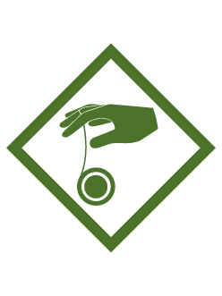

# Yo-yo Webelos Adventure

- **Adventure name:** Yo-yo
- **Rank:** Webelos
- **Type:** Elective
- **Category:** 

## Overview

T ​ ​ he sleeper , over the falls, walk the dog, and around the ​ world are ​ just some of the tricks to learn with a yo – yo . Did you know that there are world champions of yo – yo ? There are professional yo – yo champions who tour the world giving demonstrations and competing. Prior to any activity, use Scouting America SAFE Checklist to ensure the safety of all those involved.

## Requirements

### Requirement 1

Learn the safety rules of using a yo-yo and always follow them.

**Activities:**

- **[Yo… Yo… Be Safe](https://www.scouting.org/cub-scout-activities/yo-yo-be-safe/)** (Indoor, energy 1, supplies 2, prep 2)
  Cub Scouts  review the basic safety rules for using a yo-yo.

### Requirement 2

Discover how to find the proper yo-yo string length for you.

**Activities:**

- **[Aye String](https://www.scouting.org/cub-scout-activities/aye-string/)** (Indoor, energy 2, supplies 5, prep 5)
  Cub Scouts  find the proper length of string for a yo-yo.

### Requirement 3

Explain why it is important to have the correct string length and to be in the right location before throwing a yo-yo.

**Activities:**

- **[Right Length](https://www.scouting.org/cub-scout-activities/right-length/)** (Indoor, energy 2, supplies 2, prep 2)
  Cub Scouts  learn the importance of having the correct string length and how to select a safe location before throwing a yo-yo.

### Requirement 4

Demonstrate how to properly string a yo-yo and how to create a slip knot.

**Activities:**

- **[Oh Knots](https://www.scouting.org/cub-scout-activities/oh-knots/)** (Indoor, energy 2, supplies 5, prep 2)
  Cub Scouts  learn how to properly string a yo-yo and how to create a slip knot.

### Requirement 5

Conduct the pendulum experiment with a yo-yo. Explain what happens to the yo-yo when the string is longer.

**Activities:**

- **[Swinging](https://www.scouting.org/cub-scout-activities/swinging/)** (Indoor, energy 3, supplies 5, prep 2)
  Cub Scouts  conduct  the  pendulum experiment with a yo-yo.

### Requirement 6

Show that you can properly wind a yo-yo.

**Activities:**

- **[All Wound Up](https://www.scouting.org/cub-scout-activities/all-wound-up/)** (Indoor, energy 3, supplies 5, prep 2)
  Cub Scouts  show how to properly wind a yo-yo.

### Requirement 7

Attempt each of the following: gravity pull, sleeper, breakaway.

**Activities:**

- **[Yo-Yo Ninja](https://www.scouting.org/cub-scout-activities/yo-yo-ninja/)** (Indoor, energy 3, supplies 5, prep 5)
  Cub Scouts  attempt each of the following yo-yo tricks: the gravity  pull , the sleeper, and the breakaway.

## Resources

- [Yo-yo Webelos adventure page](https://www.scouting.org/cub-scout-adventures/yo-yo/)

Note: This is an unofficial archive of Cub Scout Adventures that was automatically extracted from the Scouting America website and may contain errors.