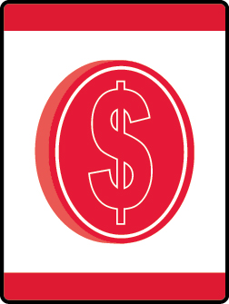

# Adventures in Coins Wolf Adventure

- **Adventure name:** Adventures in Coins
- **Rank:** Wolf
- **Type:** Elective
- **Category:** 

## Overview

To most people, coins are used to buy things they want or need. But coins can also tell a story. The pictures on United States coins tell a lot about our country’s culture and history. In this Adventure, you will get to be a numismatist (noo-MIZmuh-tist). A numismatist is a person who studies coins and money. You’ll learn where coins are made and the meaning of their pictures and words. Prior to any activity, use Scouting America SAFE Checklist to ensure the safety of all those involved. All participants in official Scouting America activities should become familiar with the Guide to Safe Scouting and applicable program literature or manuals.

## Requirements

### Requirement 1

Identify different parts of a coin.

**Activities:**

- **[Coin Designer Challenge](https://www.scouting.org/cub-scout-activities/coin-designer-challenge/)** (Indoor, energy 2, supplies 2, prep 2)
  Cub Scouts will design their own coin.
- **[Coin Hunter’s Odyssey](https://www.scouting.org/cub-scout-activities/coin-hunters-odyssey/)** (Indoor, energy 2, supplies 2, prep 2)
  Learn about coins in a coin scavenger hunt.
- **[Coin Quest Adventure](https://www.scouting.org/cub-scout-activities/coin-quest-adventure/)** (Indoor, energy 2, supplies 2, prep 2)
  Cub Scouts learn about the characteristics and values of different coins.

### Requirement 2

Find the mint mark on a coin and identify the mint facility where it was made and the year it was made.

**Activities:**

- **[Mint City Showdown](https://www.scouting.org/cub-scout-activities/mint-city-showdown/)** (Indoor, energy 2, supplies 2, prep 2)
  In this activity, Cub Scouts will count coins from each mint.
- **[Mint Mark Masterclass](https://www.scouting.org/cub-scout-activities/mint-mark-masterclass/)** (Indoor, energy 2, supplies 2, prep 2)
  Cub Scouts will learn about coin mint marks.

### Requirement 4

Choose a coin that interests you and make a coin rubbing.  List information next to the coin detailing the pictures on it, the year it was made, and the mint where it was made.

**Activities:**

- **[Coin Rubbings](https://www.scouting.org/cub-scout-activities/coin-rubbings/)** (Indoor, energy 2, supplies 2, prep 2)
  Making a coin rubbing to learn more about your favorite coin.

## Resources

- [Adventures in Coins Wolf adventure page](https://www.scouting.org/cub-scout-adventures/adventures-in-coins/)

Note: This is an unofficial archive of Cub Scout Adventures that was automatically extracted from the Scouting America website and may contain errors.