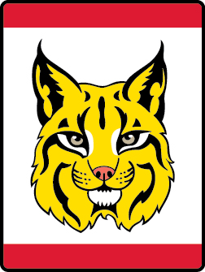

# Bobcat Wolf Wolf Adventure

- **Adventure name:** Bobcat Wolf
- **Rank:** Wolf
- **Type:** Required
- **Category:** Character & Leadership

## Overview

The Bobcat Adventure is the first required Adventure on the trail to earn the Wolf badge of rank. Once the Bobcat Adventure is completed, Wolves can start any other of the Adventures in any order. ​ ​ ​ Prior to any activity, use Scouting America SAFE Checklist to ensure the safety of all those involved. All participants in official Scouting America activities should become familiar with the Guide to Safe Scouting and applicable program literature or manuals.

## Requirements

### Requirement 1

Get to know members of your den.

**Activities:**

- **[Den Doodle Wolf](https://www.scouting.org/cub-scout-activities/den-doodle-wolf/)** (Indoor, energy 2, supplies 4, prep 4)
  A den doodle is  a way  to record advancement progress and other accomplishments of the Cub Scouts as well as a colorful decoration for the den meeting place.
- **[Den Flag Wolf](https://www.scouting.org/cub-scout-activities/den-flag-wolf/)** (Indoor, energy 2, supplies 4, prep 3)
  Making a den flag together allows Cub Scouts to show their personality and creativity while  they’re  getting to know each other.
- **[Get to Know You Bingo](https://www.scouting.org/cub-scout-activities/get-to-know-you-bingo/)** (Indoor, energy 2, supplies 2, prep 2)
  “Get to Know You” bingo is a great icebreaker activity that can help members of a den get to know each other better in a fun and interactive way.

### Requirement 2

Recite the Scout Oath and the Scout Law with your den and den leader.

**Activities:**

- **[Recite the Oath and Law Wolf](https://www.scouting.org/cub-scout-activities/recite-the-oath-and-law-wolf/)** (Indoor, energy 1, supplies 1, prep 1)
  Learn and reinforce the Scout Oath and the Scout Law by reciting it with your den.

### Requirement 3

Learn about the Scout Law.

**Activities:**

- **[Scout Law Clothespin Quest](https://www.scouting.org/cub-scout-activities/scout-law-clothespin-quest/)** (Indoor, energy 4, supplies 2, prep 2)
  Search for all the points of the Scout Law in this fun game using clothespins.
- **[Scout Law Emoji Game](https://www.scouting.org/cub-scout-activities/scout-law-emoji-game/)** (Indoor, energy 2, supplies 5, prep 2)
  Cub Scouts will learn  the Scout  Law by playing the Scout Law emoji game.
- **[Scout Law Word Search](https://www.scouting.org/cub-scout-activities/scout-law-word-search/)** (Indoor, energy 1, supplies 1, prep 2)
  The points of the Scout Law are reinforced as the Cub Scouts search for them in this word search puzzle.

### Requirement 4

With your den create a den Code of Conduct.

**Activities:**

- **[Code of Conduct Wolf](https://www.scouting.org/cub-scout-activities/code-of-conduct-wolf/)** (Indoor, energy 1, supplies 2, prep 2)
  Cub Scouts will be invested in their own conduct when they help create their den code of conduct.

### Requirement 5

Demonstrate the Cub Scout sign, Cub Scout salute and Cub Scout handshake. Show how each is used.

**Activities:**

- **[Bobcat Relay Wolf](https://www.scouting.org/cub-scout-activities/bobcat-relay-wolf/)** (Indoor, energy 3, supplies 1, prep 1)
  In this Cub Scout relay game, teams show the Cub Scout sign, salute, and handshake.
- **[Scout Sign Sound of Silence](https://www.scouting.org/cub-scout-activities/scout-sign-sound-of-silence/)** (Indoor, energy 3, supplies 1, prep 1)
  Practice the Cub Scout sign by playing the Scout Sign Sound of Silence game.
- **[Simon Says Wolf](https://www.scouting.org/cub-scout-activities/simon-says/)** (Indoor, energy 4, supplies 1, prep 1)
  Play Simon Says to learn  the Cub  Scout sign, handshake, and salute.

### Requirement 6

Share with your den, or family, a time when you demonstrated the Cub Scout motto “Do Your Best.”

**Activities:**

- **[Do Your Best Showcase](https://www.scouting.org/cub-scout-activities/do-your-best-showcase/)** (Indoor, energy 1, supplies 1, prep 1)
  Cub Scouts share a time when they did their best.

### Requirement 7

At home, with your parent or legal guardian do the activities in the booklet “How to Protect Your Children from Child Abuse: A Parent’s Guide.”

**Activities:**

- **[Child Abuse Protection Review Wolf](https://www.scouting.org/cub-scout-activities/child-abuse-protection-review-wolf/)** (Indoor, energy 1, supplies 2, prep 1)
  Review the activities in the booklet “How to Protect Your Children from Child Abuse: A Parent’s Guide.”

## Resources

- [Bobcat Wolf Wolf adventure page](https://www.scouting.org/cub-scout-adventures/bobcat-wolf/)

Note: This is an unofficial archive of Cub Scout Adventures that was automatically extracted from the Scouting America website and may contain errors.