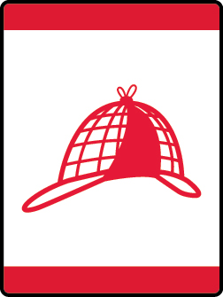

# Code of the Wolf Wolf Adventure

- **Adventure name:** Code of the Wolf
- **Rank:** Wolf
- **Type:** Elective
- **Category:** 

## Overview

You can use math to have fun!  The great thing about math is that it can be more than just adding and subtracting numbers.  Math is also about patterns and can be used to create messages.  In the world of computers, math is used to create a secret code to protect information.  Encryption is when you take a message and use a code to change it into something that no one can read unless they have a way to read the code.  This is called a key.  Making and creating codes is a form of math. Prior to any activity, use Scouting America SAFE Checklist to ensure the safety of all those involved. All participants in official Scouting America activities should become familiar with the Guide to Safe Scouting and applicable program literature or manuals.

## Requirements

### Requirement 1

Create a secret code.  Send a message to a member of your den or family.  Have that person send a message back to you using the same secret code.

**Activities:**

- **[Code Stick](https://www.scouting.org/cub-scout-activities/code-stick/)** (Indoor, energy 2, supplies 2, prep 2)
  Create and decipher a code stick coded message.
- **[Decoder Wheel](https://www.scouting.org/cub-scout-activities/decoder-wheel/)** (Indoor, energy 2, supplies 2, prep 2)
  Send a secret message using a decoder wheel.
- **[Pigpen Code](https://www.scouting.org/cub-scout-activities/pigpen-code/)** (Indoor, energy 2, supplies 2, prep 2)
  Send and decode a message using Pigpen Code.

### Requirement 2

Build and play a game that requires the use of codes or patterns.

**Activities:**

- **[Code Breaker](https://www.scouting.org/cub-scout-activities/code-breaker/)** (Indoor, energy 3, supplies 2, prep 3)
  Create and decipher codes to find your destination.
- **[Essentials Quest](https://www.scouting.org/cub-scout-activities/essentials-quest/)** (Indoor, energy 2, supplies 2, prep 2)
  Play a logic game to find your buddy’s essential items first.
- **[Wolf and Fox Game](https://www.scouting.org/cub-scout-activities/wolf-and-fox-game/)** (Indoor, energy 2, supplies 2, prep 2)
  Use logic to break your opponent’s code.

### Requirement 3

Select a single shape.  Observe the environment around you.  Write down where you see that shape and how it is being used.

**Activities:**

- **[Shapes at Home](https://www.scouting.org/cub-scout-activities/shapes-at-home/)** (Indoor, energy 2, supplies 1, prep 2)
  Observe shapes inside your home.
- **[Shapes in Furniture](https://www.scouting.org/cub-scout-activities/shapes-in-furniture/)** (Travel, energy 2, supplies 1, prep 3)
  Visit a furniture store and discover which shape is most seen in furniture.
- **[Shapes in Nature](https://www.scouting.org/cub-scout-activities/shapes-in-nature/)** (Outdoor, energy 3, supplies 2, prep 2)
  Identify three different shapes that you see in nature.

### Requirement 4

Using a package that contains a number of different colored items, discover the most common color.

**Activities:**

- **[Tasty Predictions](https://www.scouting.org/cub-scout-activities/tasty-predictions/)** (Indoor, energy 2, supplies 3, prep 3)
  Predict which color of candy is most common.

## Resources

- [Code of the Wolf Wolf adventure page](https://www.scouting.org/cub-scout-adventures/code-of-the-wolf/)

Note: This is an unofficial archive of Cub Scout Adventures that was automatically extracted from the Scouting America website and may contain errors.