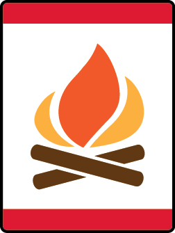

# Council Fire Wolf Adventure

- **Adventure name:** Council Fire
- **Rank:** Wolf
- **Type:** Required
- **Category:** Citizenship

## Overview

A real wolf pack works like a large family where everyone works together to keep the members of the pack safe, healthy, and happy. Working together is part of being a good citizen. In this Adventure, you will build a model community and become an active member in your community. Prior to any activity, use Scouting America SAFE Checklist to ensure the safety of all those involved. All participants in official Scouting America activities should become familiar with the Guide to Safe Scouting and applicable program literature or manuals.

## Requirements

### Requirement 1

Learn how to properly care for and fold the United States flag. With your den or pack, participate in a flag ceremony.

**Activities:**

- **[Fold the Flag](https://www.scouting.org/cub-scout-activities/fold-the-flag/)** (Indoor, energy 3, supplies 2, prep 2)
  Learn how to properly fold the United States flag.

### Requirement 2

Identify three points of the Scout Law that are important to being a good neighbor.

**Activities:**

- **[Scout Law in Song](https://www.scouting.org/cub-scout-activities/scout-law-in-song/)** (Indoor, energy 2, supplies 2, prep 2)
  Compose a song about the three points of the Scout Law that are important to being a good neighbor.
- **[Scout Skit Showcase](https://www.scouting.org/cub-scout-activities/scout-skit-showcase/)** (Indoor, energy 3, supplies 2, prep 2)
  Create and perform a skit  demonstrating  the three points of the Scout Law that are important to being a good neighbor.
- **[Sketching the Scout Law](https://www.scouting.org/cub-scout-activities/sketching-the-scout-law/)** (Indoor, energy 2, supplies 2, prep 2)
  Draw pictures that  demonstrate  the three points of the Scout Law that are important to being a good neighbor.

### Requirement 3

Build a model of your home.

**Activities:**

- **[Building My Home with Cardboard](https://www.scouting.org/cub-scout-activities/building-my-home-with-cardboard/)** (Indoor, energy 2, supplies 2, prep 2)
  Use household items to build a model of your home.
- **[Building My Home with Toys](https://www.scouting.org/cub-scout-activities/building-my-home-with-toys/)** (Indoor, energy 3, supplies 5, prep 2)
  Use Lego® bricks, Lincoln Logs®, Tinker Toys® sets, or other building toys to build a model of your home.

### Requirement 4

Using the same materials from requirement 3, create a model of a building in your community.

**Activities:**

- **[Community Buildings](https://www.scouting.org/cub-scout-activities/community-buildings/)** (Indoor, energy 2, supplies 2, prep 2)
  Build  a model of a building in your community.

### Requirement 5

Using the models built in requirements 3 and 4, create a neighborhood.

**Activities:**

- **[Building My Neighborhood](https://www.scouting.org/cub-scout-activities/building-my-neighborhood/)** (Indoor, energy 2, supplies 2, prep 2)
  Using the models that your den built, create a neighborhood.

### Requirement 6

Participate in a service project.  Explain how your volunteering is helpful to your neighborhood.

**Activities:**

- **[10,000 for the Troops – Wolf](https://www.scouting.org/cub-scout-activities/10000-for-the-troops-wolf/)** (Indoor, energy 2, supplies 2, prep 2)
  Cub Scouts participate in a special nation-wide project to create holiday cards for military personnel.  Please have letters mailed to the Scouting America National Service Center by November 7, 2025 .
- **[Helping our Four-Legged Friends](https://www.scouting.org/cub-scout-activities/helping-our-four-legged-friends/)** (Travel, energy 3, supplies 3, prep 5)
  With your den, host a pet food drive to support a local pet shelter.
- **[Scouting for Food Wolf](https://www.scouting.org/cub-scout-activities/scouting-for-food-wolf/)** (Travel, energy 3, supplies 1, prep 5)
  Participate in  your  Council-sponsored  Scouting for Food  event.
- **[Toys for Tots Toy Drive](https://www.scouting.org/cub-scout-activities/toys-for-tots-toy-drive/)** (Travel, energy 3, supplies 3, prep 5)
  With your pack, organize a toy drive to  support  ”Toys  for Tots”  or another organization.

## Resources

- [Council Fire Wolf adventure page](https://www.scouting.org/cub-scout-adventures/council-fire/)

Note: This is an unofficial archive of Cub Scout Adventures that was automatically extracted from the Scouting America website and may contain errors.