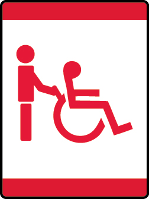

# Cubs Who Care Wolf Adventure

- **Adventure name:** Cubs Who Care
- **Rank:** Wolf
- **Type:** Elective
- **Category:** 

## Overview

Scouts understand just how many things people with disabilities are able to do. You will discover some challenges people with disabilities face, and you will have the chance to try facing similar challenges yourself . A single activity can’t show you everything about life with a disability, but it can help you understand a little more about the ways a person with a disability is able to do things. Prior to any activity, use Scouting America SAFE Checklist to ensure the safety of all those involved. All participants in official Scouting America activities should become familiar with the Guide to Safe Scouting and applicable program literature or manuals.

## Requirements

### Requirement 1

Explore what it is to have a physical disability.

**Activities:**

- **[Chair Ball](https://www.scouting.org/cub-scout-activities/chair-ball/)** (Indoor, energy 4, supplies 2, prep 2)
  Cub Scouts shoot baskets from a sitting position.
- **[Draw a Picture](https://www.scouting.org/cub-scout-activities/draw-a-picture/)** (Indoor, energy 2, supplies 2, prep 2)
  Cub Scouts will use tongs to draw a picture of their family.
- **[Mitten Hands](https://www.scouting.org/cub-scout-activities/mitten-hands/)** (Indoor, energy 2, supplies 4, prep 3)
  Cub Scouts wear oversized gloves to complete simple tasks.

### Requirement 2

Explore what it is to have a visual impairment.

**Activities:**

- **[Masked Artist](https://www.scouting.org/cub-scout-activities/masked-artist/)** (Indoor, energy 2, supplies 2, prep 2)
  Cub Scouts draw a picture then try to draw it again with their eyes covered.
- **[Service Dog Visit](https://www.scouting.org/cub-scout-activities/service-dog-visit/)** (Outdoor, energy 2, supplies 5, prep 5)
  Cub Scouts learn about service dogs.
- **[Where is the ball?](https://www.scouting.org/cub-scout-activities/where-is-the-ball/)** (Indoor, energy 4, supplies 2, prep 3)
  Cub Scouts toss a Nerf™ ball back and forth learning depth  perception .

### Requirement 3

Explore what it is to have a hearing loss.

**Activities:**

- **[“Hello, my name is”](https://www.scouting.org/cub-scout-activities/hello-my-name-is/)** (Indoor, energy 2, supplies 2, prep 2)
  Use American Sign Language to communicate a simple sentence that includes your name.
- **[Scout Law](https://www.scouting.org/cub-scout-activities/scout-law/)** (Indoor, energy 2, supplies 3, prep 3)
  Cub Scouts try to speak to their  buddy  with a mouthful of marshmallows.
- **[Tele-What?](https://www.scouting.org/cub-scout-activities/tele-what/)** (Indoor, energy 2, supplies 4, prep 3)
  Cub Scouts play “telephone” while ears are covered.

### Requirement 4

Explore barriers to getting around.

**Activities:**

- **[Accessibility Walk Around](https://www.scouting.org/cub-scout-activities/accessibility-walk-around/)** (Indoor, energy 3, supplies 1, prep 1)
  Cub Scouts will take a walk around your meeting space to  identify  accommodations and lack of accommodations for people with disabilities.
- **[Out of Reach](https://www.scouting.org/cub-scout-activities/out-of-reach/)** (Indoor, energy 2, supplies 2, prep 1)
  Cub Scouts sit on chairs to explore barriers to getting around.

## Resources

- [Cubs Who Care Wolf adventure page](https://www.scouting.org/cub-scout-adventures/cubs-who-care/)

Note: This is an unofficial archive of Cub Scout Adventures that was automatically extracted from the Scouting America website and may contain errors.