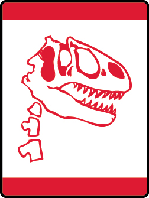

# Digging in the Past Wolf Adventure

- **Adventure name:** Digging in the Past
- **Rank:** Wolf
- **Type:** Elective
- **Category:** 

## Overview

Dinosaurs and other giant creatures lived and died out millions of years ago, so thankfully you won’t run into one on a walk.  A scientist who studies dinosaurs is called a paleontologist (pa-le-on-to-lo-gist).  They study dinosaur bones and fossils to learn more about their habits, the food they ate, and their size. During this Adventure, you will match dinosaurs to their names, and you’ll use your imagination to create your own dinosaur. Prior to any activity, use Scouting America SAFE Checklist to ensure the safety of all those involved. All participants in official Scouting America activities should become familiar with the Guide to Safe Scouting and applicable program literature or manuals.

## Requirements

### Requirement 1

Play a dinosaur game that shows what you know about them.

**Activities:**

- **[Dino Detective](https://www.scouting.org/cub-scout-activities/dino-detective/)** (Indoor, energy 1, supplies 2, prep 2)
  Play a dinosaur identification game.
- **[Dino Match](https://www.scouting.org/cub-scout-activities/dino-match/)** (Indoor, energy 2, supplies 2, prep 2)
  Play a dinosaur matching game.
- **[Dino Trivia](https://www.scouting.org/cub-scout-activities/dino-trivia/)** (Indoor, energy 1, supplies 2, prep 2)
  Play a dinosaur trivia game.

### Requirement 2

Create an imaginary dinosaur. Share with your den or family its name, what it eats, its size, and where it lives.

**Activities:**

- **[Dino Clay Creations](https://www.scouting.org/cub-scout-activities/dino-clay-creations/)** (Indoor, energy 2, supplies 4, prep 2)
  Make a dinosaur out of clay.
- **[Dino Imagination](https://www.scouting.org/cub-scout-activities/dino-imagination/)** (Indoor, energy 2, supplies 3, prep 2)
  Create custom dinosaurs by assembling cutout body parts.
- **[Recycled Reptiles](https://www.scouting.org/cub-scout-activities/recycled-reptiles/)** (Indoor, energy 2, supplies 3, prep 2)
  Create an imaginary dinosaur out of recycled materials.

### Requirement 3

Be a paleontologist and dig through a dinosaur dig.

**Activities:**

- **[Dino Dig](https://www.scouting.org/cub-scout-activities/dino-dig/)** (Indoor, energy 3, supplies 4, prep 2)
  Make a dinosaur dig.
- **[Dino Egg Dig](https://www.scouting.org/cub-scout-activities/dino-egg-dig/)** (Indoor, energy 3, supplies 3, prep 2)
  Cub Scouts will make dinosaur eggs.
- **[Fossil Expedition](https://www.scouting.org/cub-scout-activities/fossil-expedition/)** (Travel, energy 4, supplies 2, prep 7)
  Visit a location where fossils can be found.

## Resources

- [Digging in the Past Wolf adventure page](https://www.scouting.org/cub-scout-adventures/digging-in-the-past/)

Note: This is an unofficial archive of Cub Scout Adventures that was automatically extracted from the Scouting America website and may contain errors.