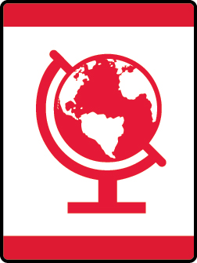

# Finding Your Way Wolf Adventure

- **Adventure name:** Finding Your Way
- **Rank:** Wolf
- **Type:** Elective
- **Category:** 

## Overview

The ancient Greeks went on many adventures. Their writings told of faraway lands and treasures. To explain where their adventures took them, they created geography. Geography is the science of the Earth’s surface. Geo means “earth” and grapho means “to write.” Maps and compasses are tools that have helped travelers know if they are headed in the right direction. In this Adventure, you will learn to read maps and use one on a walk. You’ll also get to make your own map and use a compass on a scavenger hunt. Just like the ancient Greek explorers, it’s time for you to lead the way on another great adventure. Prior to any activity, use Scouting America SAFE Checklist to ensure the safety of all those involved.

## Requirements

### Requirement 1

Using a map, locate where you live.

**Activities:**

- **[Google Maps Adventure](https://www.scouting.org/cub-scout-activities/google-maps-adventure/)** (Indoor, energy 1, supplies 2, prep 1)
  Cub Scouts use Google Maps to show where they live.
- **[Home Sweet Map](https://www.scouting.org/cub-scout-activities/home-sweet-map/)** (Indoor, energy 2, supplies 2, prep 2)
  Cub Scouts find and show their town on a map.

### Requirement 2

Draw a map for a friend to locate your home or school.  Create a key for the map.

**Activities:**

- **[Let’s Go Home](https://www.scouting.org/cub-scout-activities/lets-go-home/)** (Indoor, energy 2, supplies 2, prep 2)
  Cub Scouts draw a map to their house.

### Requirement 3

Find the directions north, east, south, and west and the compass rose on a map.

**Activities:**

- **[Make a Compass Rose](https://www.scouting.org/cub-scout-activities/make-a-compass-rose/)** (Indoor, energy 2, supplies 2, prep 2)
  Cub Scouts learn about directions by making a paper plate compass rose.

### Requirement 4

Find the directions north, east, south, and west using a compass.

**Activities:**

- **[Campsite Compass](https://www.scouting.org/cub-scout-activities/campsite-compass/)** (Indoor, energy 2, supplies 2, prep 2)
  Cub Scouts learn directions with this campsite compass  activity.
- **[Create a Sundial](https://www.scouting.org/cub-scout-activities/create-a-sundial/)** (Indoor, energy 2, supplies 3, prep 3)
  Cub Scouts make a sundial.
- **[Simon Says Never Eat Soggy Waffles](https://www.scouting.org/cub-scout-activities/simon-says-never-eat-soggy-waffles/)** (Indoor, energy 4, supplies 2, prep 2)
  Cub Scouts learn directions by playing a Simon Says using a compass.

### Requirement 5

Practice using both a map and a compass.

**Activities:**

- **[Go Geocaching™](https://www.scouting.org/cub-scout-activities/go-geocaching/)** (Travel, energy 4, supplies 2, prep 5)
  Cub Scouts go Geocaching using maps and a compass.
- **[Map Meandering Mission](https://www.scouting.org/cub-scout-activities/map-meandering-mission/)** (Outdoor, energy 4, supplies 3, prep 2)
  Cub Scouts practice using a map and compass while taking a walk in their neighborhood.
- **[Park Map Journey](https://www.scouting.org/cub-scout-activities/park-map-journey/)** (Outdoor, energy 3, supplies 2, prep 2)
  Practice using a map and compass at a park.

## Resources

- [Finding Your Way Wolf adventure page](https://www.scouting.org/cub-scout-adventures/finding-your-way/)

Note: This is an unofficial archive of Cub Scout Adventures that was automatically extracted from the Scouting America website and may contain errors.