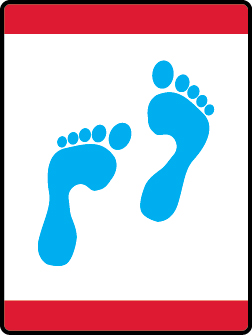

# Footsteps Wolf Adventure

- **Adventure name:** Footsteps
- **Rank:** Wolf
- **Type:** Required
- **Category:** Family & Reverence

## Overview

In this Adventure, you are encouraged to learn more about your family’s faith traditions. You will complete most of these requirements at home with your family. Faith means having complete trust or confidence in someone or something.  “Trustworthy” is the first part of the Scout Law. Through Aesop’s fable you will learn why being trustworthy is so important. This Adventure is commonly done at home with the Cub Scout’s family. If it is being done as a den ensure that every parent and guardian is aware of the content and the activities that the den will do and allow for parents to opt out of doing it as a den activity and choose to complete the requirement at home. Prior to any activity, use Scouting America SAFE Checklist to ensure the safety of all those involved.

## Requirements

### Requirement 1

With your parent or legal guardian talk about your family’s faith traditions.   Identify three holidays or celebrations that are part of your family’s faith traditions. Make a craft or work of art of your favorite family’s faith tradition holiday or celebration.

**Activities:**

- **[Holiday Mosaic](https://www.scouting.org/cub-scout-activities/holiday-mosaic/)** (Indoor, energy 2, supplies 3, prep 2)
  Make a construction paper mosaic using your family’s favorite holiday tradition symbol.
- **[Sun Catcher](https://www.scouting.org/cub-scout-activities/sun-catcher/)** (Indoor, energy 2, supplies 3, prep 2)
  Make a sun catcher  of a holiday symbol  that can be hung in your home.

### Requirement 2

With your family, attend a religious service OR other gathering that shows how your family expresses reverence.

**Activities:**

- **[Attend a Religious Service](https://www.scouting.org/cub-scout-activities/attend-a-religious-service/)** (Travel, energy 1, supplies 1, prep 5)
  Attend a religious service based on your family’s choosing.
- **[Let’s Celebrate Together](https://www.scouting.org/cub-scout-activities/lets-celebrate-together/)** (Travel, energy 2, supplies 1, prep 5)
  Attend a celebration  at your chartered partner  based on a faith tradition.

### Requirement 3

Carry out an act of kindness.

**Activities:**

- **[Kindness Jar](https://www.scouting.org/cub-scout-activities/kindness-jar/)** (Indoor, energy 2, supplies 4, prep 2)
  Create an act of kindness jar and complete at least two tasks in the jar.
- **[Sing with the Elderly](https://www.scouting.org/cub-scout-activities/sing-with-the-elderly/)** (Travel, energy 2, supplies 2, prep 5)
  Sing a song at a retirement community.

### Requirement 4

Listen to or read Aesop’s fable “The Boy Who Cried Wolf.” With your den or family discuss why being truthful is important.

**Activities:**

- **[Boy Who Cried Wolf](https://www.scouting.org/cub-scout-activities/boy-who-cried-wolf/)** (Indoor, energy 1, supplies 2, prep 2)
  Read aloud to your den Aesop’s fable “The Boy Who Cried Wolf”

## Resources

- [Footsteps Wolf adventure page](https://www.scouting.org/cub-scout-adventures/footsteps/)

Note: This is an unofficial archive of Cub Scout Adventures that was automatically extracted from the Scouting America website and may contain errors.