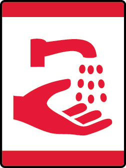

# Germs Alive! Wolf Adventure

- **Adventure name:** Germs Alive!
- **Rank:** Wolf
- **Type:** Elective
- **Category:** 

## Overview

In this Adventure, you’ll get to explore how to keep your body healthy. Why is it important to wash your hands? Why is the slimy mucus in your nose (yep, snot) important to your health? What happens if you sneeze into the air instead of into the bend in your elbow? How does keeping your room clean help keep you healthy? We will explore all of these questions while we journey through the sticky, sickening world of germs. Prior to any activity, use Scouting America SAFE Checklist to ensure the safety of all those involved. All participants in official Scouting America activities should become familiar with the Guide to Safe Scouting and applicable program literature or manuals.

## Requirements

### Requirement 1

Wash your hands with soap and water while singing the “Happy Birthday” song two times.

**Activities:**

- **[Happy Birthday Hand Washing](https://www.scouting.org/cub-scout-activities/happy-birthday-hand-washing/)** (Indoor, energy 3, supplies 2, prep 2)
  Sing Happy Birthday while washing hands.

### Requirement 2

Play Germ Magnet with our den or your family. Wash your hands afterward.

**Activities:**

- **[Glitter Germ Magnet](https://www.scouting.org/cub-scout-activities/glitter-germ-magnet/)** (Indoor, energy 3, supplies 2, prep 2)
  Play Glitter Germ Magnet to see how germs are easily spread.
- **[Glo Germ™ Exploration](https://www.scouting.org/cub-scout-activities/glo-germ-exploration/)** (Indoor, energy 3, supplies 4, prep 3)
  Using Glo Germ ™ , Cub Scouts learn about the spread of germs.

### Requirement 5

Grow a mold culture. Show what formed at a den or pack meeting.

**Activities:**

- **[Germy Bread Investigation](https://www.scouting.org/cub-scout-activities/germy-bread-investigation/)** (Indoor, energy 3, supplies 2, prep 2)
  Cub Scouts learn about the importance of hand hygiene and the spread of germs by conducting a hands-on bread mold experiment.
- **[Moldy Meals Mystery](https://www.scouting.org/cub-scout-activities/moldy-meals-mystery/)** (Indoor, energy 3, supplies 3, prep 2)
  Cub Scouts learn which foods are more susceptible to growing mold.

## Resources

- [Germs Alive! Wolf adventure page](https://www.scouting.org/cub-scout-adventures/germs-alive/)

Note: This is an unofficial archive of Cub Scout Adventures that was automatically extracted from the Scouting America website and may contain errors.