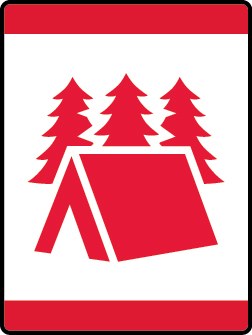

# Let’s Camp Wolf Wolf Adventure

- **Adventure name:** Let’s Camp Wolf
- **Rank:** Wolf
- **Type:** Elective
- **Category:** 

## Overview

You are about to go on an overnight campout. Sleeping in a tent, roasting marshmallows, and exploring nature are some of the best parts of being a Cub Scout. Before you go, make a list of what you need to bring. Your den leader and parent(s) will help you get ready. Each time you go camping, you can show you are a Wolf Scout by doing more on your own. Prior to any activity, use Scouting America SAFE Checklist to ensure the safety of all those involved. All participants in official Scouting America activities should become familiar with the Guide to Safe Scouting and applicable program literature or manuals.

## Requirements

### Requirement 1

Learn about the buddy system and how it works in the outdoors.

**Activities:**

- **[Buddy Calls](https://www.scouting.org/cub-scout-activities/buddy-calls/)** (Indoor, energy 2, supplies 2, prep 2)
  Cub Scouts find their buddy using animal sounds.
- **[Buddy Walk](https://www.scouting.org/cub-scout-activities/buddy-walk/)** (Indoor, energy 4, supplies 2, prep 2)
  Learn buddy teamwork during this relay game.

### Requirement 2

Know the Cub Scout Six Essentials.

**Activities:**

- **[Cub Scout Six Essentials Kim’s Game](https://www.scouting.org/cub-scout-activities/cub-scout-six-essentials-kims-game/)** (Indoor, energy 2, supplies 4, prep 3)
  Play Kim’s game and learn the Cub Scout Six Essentials.
- **[Make a Cub Scout Six Essential Kit](https://www.scouting.org/cub-scout-activities/make-a-cub-scout-six-essential-kit/)** (Indoor, energy 3, supplies 3, prep 2)
  Cub Scouts create their own Cub Scout Six Essentials kit.

### Requirement 3

In addition to your Cub Scout Six Essentials, list the personal items you need for your campout.

**Activities:**

- **[Packing Relay](https://www.scouting.org/cub-scout-activities/packing-relay/)** (Indoor, energy 4, supplies 4, prep 3)
  Cub Scout teams pack a backpack for a camping trip.
- **[What Would You Bring?](https://www.scouting.org/cub-scout-activities/what-would-you-bring/)** (Indoor, energy 3, supplies 4, prep 3)
  Cub Scouts determine what is a “need” or “want” for a campout.

### Requirement 5

Attend a council or district Cub Scout overnight camp or attend a campout with your pack.

**Activities:**

- **[Council Camping Wolf](https://www.scouting.org/cub-scout-activities/council-camping-wolf/)** (Travel, energy 5, supplies 5, prep 5)
  Go camping at your local council camp.
- **[Pack Camping Wolf](https://www.scouting.org/cub-scout-activities/pack-camping-wolf/)** (Travel, energy 5, supplies 5, prep 5)
  Go camping with your pack.

## Resources

- [Let’s Camp Wolf Wolf adventure page](https://www.scouting.org/cub-scout-adventures/lets-camp-wolf/)

Note: This is an unofficial archive of Cub Scout Adventures that was automatically extracted from the Scouting America website and may contain errors.