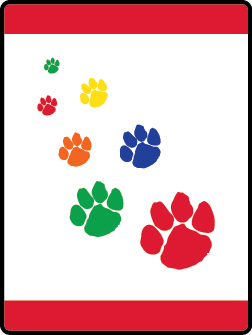

# Paws on the Path Wolf Adventure

- **Adventure name:** Paws on the Path
- **Rank:** Wolf
- **Type:** Required
- **Category:** Outdoors

## Overview

It is time to go outside!  Every journey begins with just one step, and that first step can take you on a fun-filled adventure simply by going outside for a walk, just like the one you and your Wolf den are about to take. Where you take your walk is up to your den.  It may be a walk around the center of your city or town, it may be at a local park with a trail, or it may be a trail in a forest.  No matter where you take your walk you will see signs of nature in different forms. Prior to any activity, use Scouting America SAFE Checklist to ensure the safety of all those involved.

## Requirements

### Requirement 1

Identify the Cub Scout Six Essentials. Show what you do with each item.

**Activities:**

- **[Cub Scout Six Essentials Clue](https://www.scouting.org/cub-scout-activities/cub-scout-six-essentials-clue/)** (Indoor, energy 2, supplies 2, prep 2)
  ​ Cub Scouts attempt to guess which of the Cub Scout Six Essentials is being described by one-word clues. ​ ​ ​
- **[Cub Scout Six Essentials Scavenger Hunt](https://www.scouting.org/cub-scout-activities/cub-scout-six-essentials-scavenger-hunt/)** (Indoor, energy 4, supplies 2, prep 2)
  Go around your home and find as many essentials as  possible that you can  and put them in your pack or bag.
- **[What Cub Scout Essential Am I?](https://www.scouting.org/cub-scout-activities/what-cub-scout-essential-am-i/)** (Indoor, energy 2, supplies 2, prep 2)
  Cub Scouts will guess the Cub Scout Six Essentials by giving word clues to their buddy.

### Requirement 2

Learn about the buddy system and how it works in the outdoors. Pick a buddy for your walk.

**Activities:**

- **[1-2  Buddies](https://www.scouting.org/cub-scout-activities/1-2-buddies/)** (Indoor, energy 1, supplies 1, prep 1)
  ​ ​ Arrange Cub Scouts in alphabetical order and give them numbers 1-2 in sequence to quickly select buddies. ​ ​ ​ ​ ​
- **[Buddy Circle Game](https://www.scouting.org/cub-scout-activities/buddy-circle-game/)** (Indoor, energy 3, supplies 1, prep 1)
  Cub Scouts find their buddy in this enjoyable circle game.
- **[Popsicle Stick Buddies](https://www.scouting.org/cub-scout-activities/popsicle-stick-buddies/)** (Indoor, energy 1, supplies 3, prep 2)
  Popsicle sticks are used  to pair buddies.

### Requirement 3

Identify appropriate clothes and shoes for your walk outside. Do your best to wear them on your walk.

**Activities:**

- **[Clothing Store Visit](https://www.scouting.org/cub-scout-activities/clothing-store-visit/)** (Travel, energy 2, supplies 1, prep 5)
  Visit an outdoor clothing store to  understand the importance of selecting appropriate attire for different outdoor occasions and weather conditions.
- **[Seasonal Clothing Relay](https://www.scouting.org/cub-scout-activities/seasonal-clothing-relay/)** (Indoor, energy 5, supplies 3, prep 3)
  Play a relay game to identify the right clothes and shoes to wear on a walk during different seasons.
- **[Sketchy Weather Wardrobe](https://www.scouting.org/cub-scout-activities/sketchy-weather-wardrobe/)** (Indoor, energy 1, supplies 2, prep 2)
  Cub Scouts draw picture ​ s ​  of clothes they would wear when it: rains, snows, sunny or windy.

### Requirement 4

Learn about the Outdoor Code and Leave No Trace Principle for Kids.

**Activities:**

- **[Outdoor Code and Leave No Trace Booklet](https://www.scouting.org/cub-scout-activities/outdoor-code-and-leave-no-trace-booklet/)** (Indoor, energy 2, supplies 3, prep 2)
  Create a booklet that illustrates the Outdoor Code and Leave No Trace  ​ Principles for Kids ​ .
- **[Outdoor Code and Leave No Trace Emoji](https://www.scouting.org/cub-scout-activities/outdoor-code-and-leave-no-trace-emoji/)** (Indoor, energy 2, supplies 2, prep 2)
  Use emojis to learn the  ​ ​ Outdoor Code and Leave No Trace  ​ Principles for Kids ​ .
- **[Outdoor Code and Leave No Trace Hand Signs](https://www.scouting.org/cub-scout-activities/outdoor-code-and-leave-no-trace-song/)** (Indoor, energy 3, supplies 1, prep 2)
  Use hand signals to learn the Outdoor Code and Leave No Trace  ​ Principles for Kids ​ .

### Requirement 5

With your den, pack, or family, take a walk outside for at least 30 minutes to explore nature in your surroundings. Describe four different animals, domestic or wild, that you could see on your walk.

**Activities:**

- **[Outdoor Scavenger Hunt](https://www.scouting.org/cub-scout-activities/outdoor-scavenger-hunt/)** (Outdoor, energy 5, supplies 2, prep 2)
  Take a 30 minute​ or more​ walk. Describe four animals that you might see on your walk.

## Resources

- [Paws on the Path Wolf adventure page](https://www.scouting.org/cub-scout-adventures/paws-on-the-path/)

Note: This is an unofficial archive of Cub Scout Adventures that was automatically extracted from the Scouting America website and may contain errors.